# [Nombre de la Aplicación]

## 👥 Miembros del Equipo
| Nombre y Apellidos | Correo URJC | Usuario GitHub |
|:--- |:--- |:--- |
| Oliver Infante Jarana | o.infante.2024@alumnos.urjc.es | 0L1V3R5 |
| Fernando Montero Molina | f.montero.2024@alumnos.urjc.es | feerr5 |
| Hugo Vara Carbajo | h.vara.2024@alumnos.urjc.es | Hvara14 |
| Jose Carlos Hernampérez Moreno | jc.hernamperez.2024@alumnos.urjc.es | jcarlos03 |

---

## 🎭 **Preparación: Definición del Proyecto**

### **Descripción del Tema**
Nuestra aplicación, llamada Hospédate, trata sobre la gestión de venta de habitaciones de hoteles, pudiendose realizar reseñas para su publicitación y reservas que nosotros mismos gestionamos con el propio hotel. Pertenece al sector TravelTech y al usuario le aporta la facilidad de tener un entorno más gráfico y simple para poder reservar hoteles para sus vacaciones.

### **Entidades**
Indicar las entidades principales que gestionará la aplicación y las relaciones entre ellas:

1. **[Entidad 1]**: Usuario
2. **[Entidad 2]**: Hoteles
3. **[Entidad 3]**: Reseñas
4. **[Entidad 4]**: Reservas

**Relaciones entre entidades:**
- Usuario - Reseñas: Un usuario puede tener hacer múltiples reseñas sobre múltiples hoteles 
- Hotel - Reseña: Un hotel puede tener múltiples reseñas de múltiples usuarios
- Usuario - Reserva: Un usuario puede tener múltiples reservas de múltiples hoteles
- Hotel - Reserva: Un hotel puede tener varias reservas

### **Permisos de los Usuarios**
Describir los permisos de cada tipo de usuario e indicar de qué entidades es dueño:

* **Usuario Anónimo**: 
  - Permisos: Visualización del catálogo de hoteles sin la posiblidad de realizar reservas, puede registrarse.
  - No es dueño de ninguna entidad

* **Usuario Registrado**: 
  - Permisos: Gestionar su perfil, visualizar el catálogo de hoteles, reservar hoteles y realizar reseñas.
  - Es dueño de: Sus reservas, su propio perfil y sus reseñas.

* **Administrador**: 
  - Permisos: Creación, eliminación y modificación de hoteles, gestión de usuarios registrados.
  - Es dueño de: Hoteles, usuarios y sus reservas.

### **Imágenes**
Indicar qué entidades tendrán asociadas una o varias imágenes:

- **[Entidad con imágenes 1]**: Usuario - Una imagen de avatar por usuario
- **[Entidad con imágenes 2]**: Hoteles - Múltiples imágenes por hotel (galería)

---

## 🛠 **Práctica 1: Maquetación de páginas con HTML y CSS**

### **Vídeo de Demostración**
📹 **[Enlace al vídeo en YouTube](https://youtu.be/w53Uzjxnvc0)**
> Vídeo mostrando las principales funcionalidades de la aplicación web.

### **Diagrama de Navegación**
Diagrama que muestra cómo se navega entre las diferentes páginas de la aplicación:


**Descripción**: <br><br>
-**Usuario no registrado**: este usuario puede navegar por la pagina, pero no puede terminar de realizar la reserva.  <br>
-**Usuario registrado**: este usuario puede realizar reseñas y reservas, modificar su informacion de perfil y ver sus reservas y reseñas realizadas. <br>
-**Usuario administrador**: es el único usuario que puede acceder al panel de administrador desde la pantalla de perfil y modificar datos de usuarios y hoteles. <br>


### **Capturas de Pantalla y Descripción de Páginas**

#### **1. Página Principal / Home**
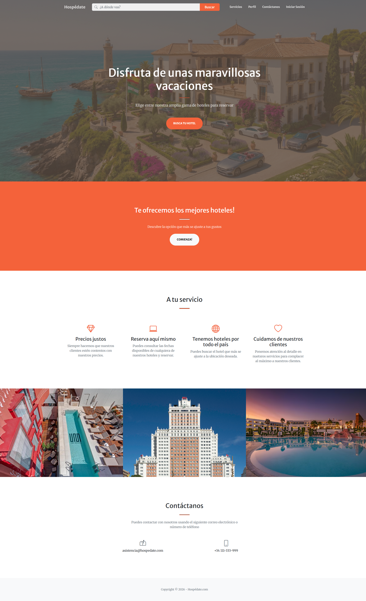

> [Página de inicio que muestra un banner promocional, información de servicios, contactos y tres de los hoteles más populares. Incluye barra de navegación, la barra de búsqueda, acceso a registro/login para usuarios no autenticados y acceso a secciones de información de servicios y contacto.]

#### **2. Página de lista de hoteles**
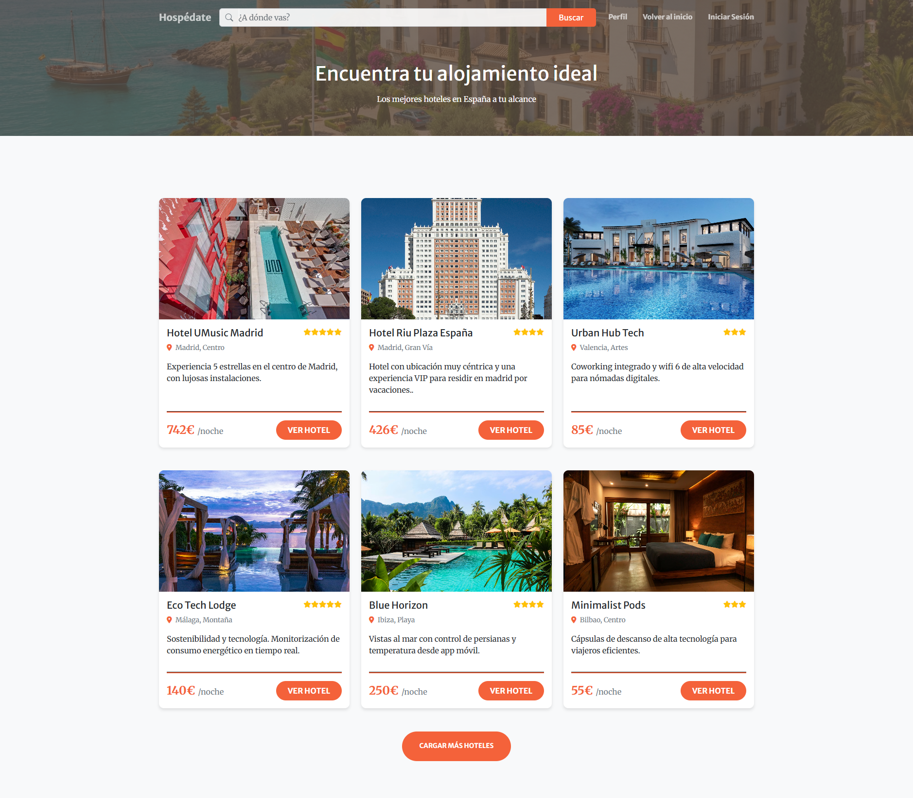

> [Página en la que se muestra una lista de hoteles desde la que se puede acceder a las páginas de los diferentes hoteles, incluye la barra de búsqueda y navegación con las opciones de acceso a perfil, al inicio de sesión y de vuelta al inicio.]

#### **3. Página de hotel**
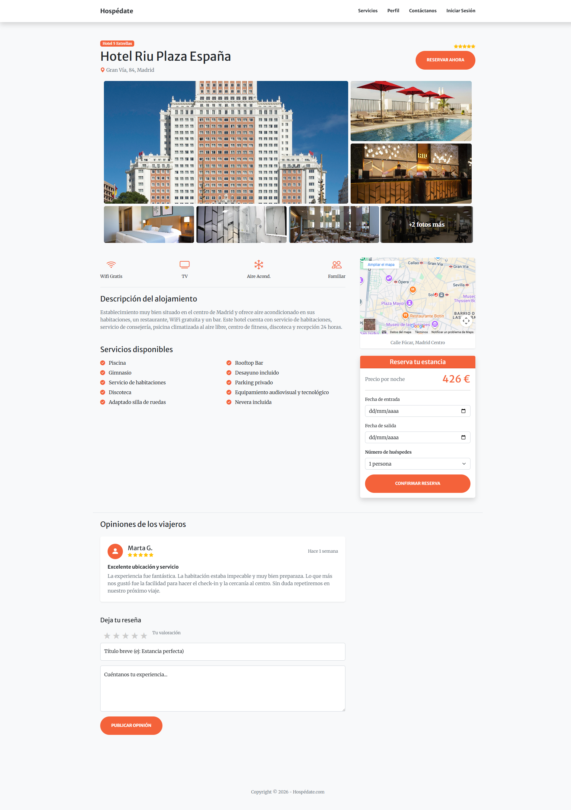

> [Página con la información del hotel, incluye una galería de imágenes del hotel, las reseñas de otros usuarios, el formulario para añadir una reseña y una tarjeta en la que elegir las fechas y número de huéspedes para reservar, junto con el botón de acceso a la confirmación de la reserva.]

#### **4. Página de resumen y confirmación de reserva**
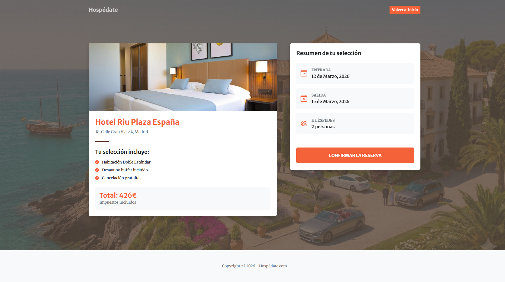

> [Página con dos tarjetas en la que se muestran los servicios y detalles de la reserva, además de un botón para finalizar la reserva.]

#### **5. Página de inicio de sesión**
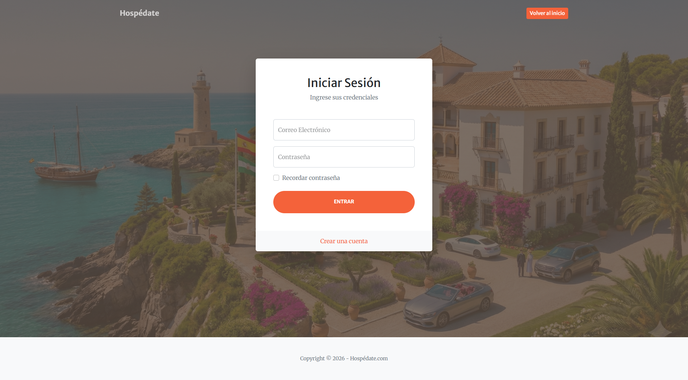

> [Página con un formulario para el inicio de sesión, además incluye la opción de acceder a la página de registro si no se posee un usuario registrado, y la opción de volver a la página principal.]

#### **6. Página de registro**
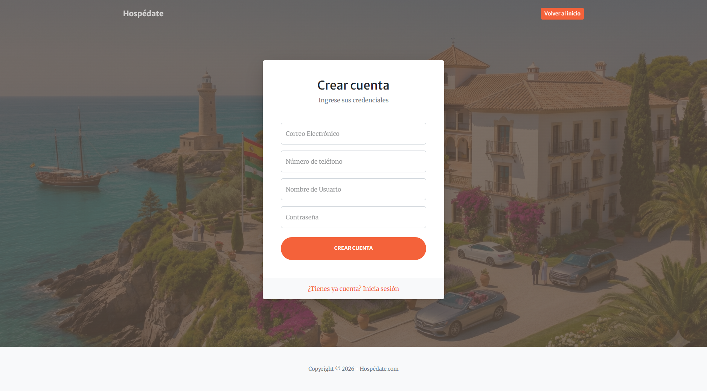

> [Página que muestra un formulario para el registro de un usuario. Incluye un acceso a la página de inicio de sesión si se posee usuario registrado y la opción de volver al inicio.]

#### **7. Página de perfil de usuario**
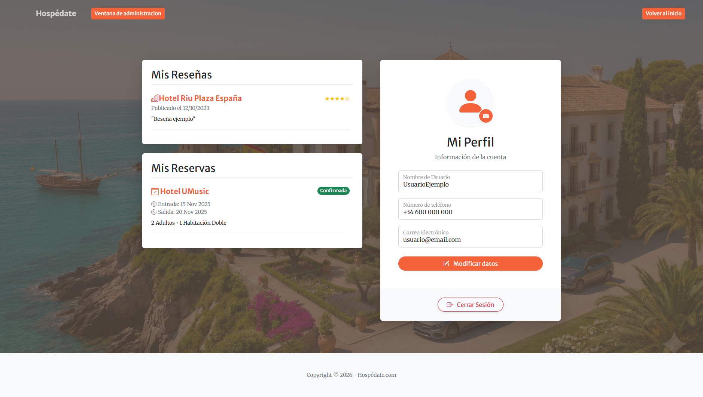

> [Página que muestra un panel con la información del usuario, junto a las opciones de modificar sus datos, subir una imagen de perfil y de cerrar sesión. Incluye también un panel mostrando las reservas y otro panel mostrando las reseñas del usuario, además de un botón para volver al incio o para acceder al panel de administrador. ]

#### **8. Página de administración de hoteles**
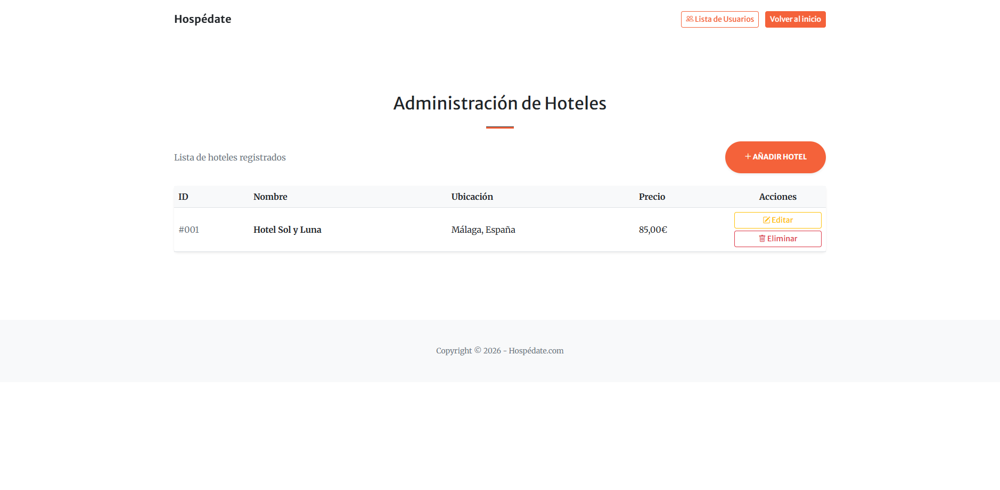

> [Página a la que únicamente tiene acceso el administrador en la que se muestra la lista de hoteles junto con las opciones de añadir, editar o eliminar dichas entidades. Incluye un botón para cambiar a la ventana de administración de usuarios y para la vuelta al inicio.]

#### **9. Página de edición de hoteles**


> [Página que cuenta con un formulario para que el administrador pueda editar la información del hotel seleccionado.]

#### **10. Página de creación de hoteles**
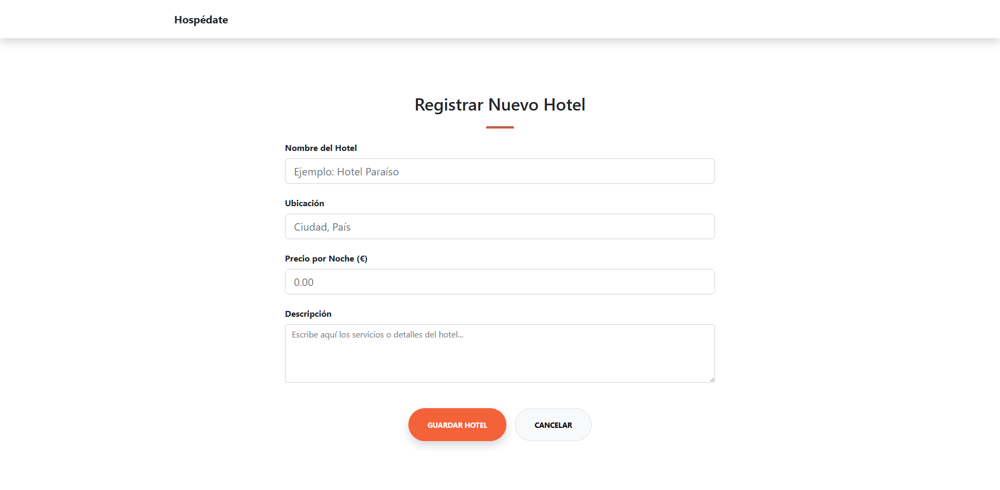

> [Página con un formulario para que el administrador pueda crear un hotel añadiendo la información.]

#### **11. Página de administración de usuarios**
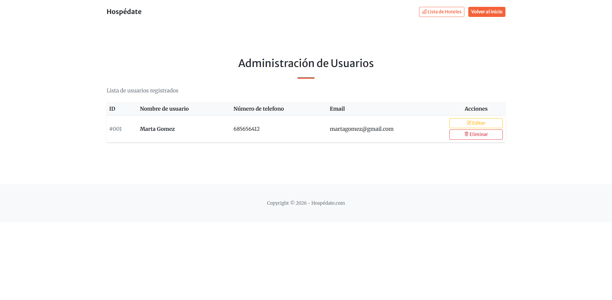

> [Página a la que únicamente tiene acceso el administrador y desde la que puede visualizar una lista de los usuarios junto con la opción de editar su información y eliminarlos.]

#### **12. Página de edición de usuarios**
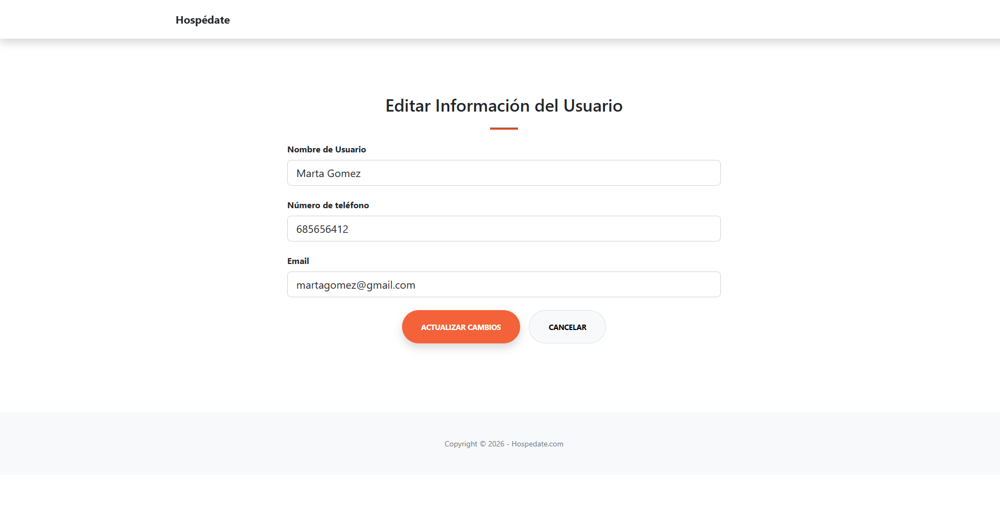

> [Página en la que el administrador puede editar la información de los usuarios.]


### **Participación de Miembros en la Práctica 1**

#### **Alumno 1 - Oliver Infante Jarana**

Creador de la página principal (index) y la página de resumen de reservas, también ha aportado pequeños cambios en otros archivos para implementar ciertas mejoras o correciones.

| Nº    | Commits      | Files      |
|:------------: |:------------:| :------------:|
|1| [Subida de plantilla gratuita](https://github.com/DWS-2026/dws-2026-project-base/commit/ece22bd905f99684f9cd33c7c6fbf00eb75498cf)  | [index.html](https://github.com/DWS-2026/dws-2026-project-base/blame/ece22bd905f99684f9cd33c7c6fbf00eb75498cf/index.html) <br>[style.css](https://github.com/DWS-2026/dws-2026-project-base/blob/ece22bd905f99684f9cd33c7c6fbf00eb75498cf/css/styles.css)   |
|2| [Cambios de frases e imágenes de prueba en el index](https://github.com/DWS-2026/dws-2026-project-base/commit/3539a6ced75649a3b3909178f48784268cdffde9)  | [index.html](https://github.com/DWS-2026/dws-2026-project-base/blob/3539a6ced75649a3b3909178f48784268cdffde9/index.html)   |
|3| [Cambios en la barra de navegación, implementación de la barra de búsqueda, implementación de script de la transparencia de la barra de búsqueda al hacer hover y subida de icono de prueba (no definitivo)](https://github.com/DWS-2026/dws-2026-project-base/commit/423085cb144c086f95e67f072ea9c438ab36b430#diff-0eb547304658805aad788d320f10bf1f292797b5e6d745a3bf617584da017051)  | [index.html](https://github.com/DWS-2026/dws-2026-project-base/blob/423085cb144c086f95e67f072ea9c438ab36b430/index.html) <br> [favicon.ico](https://github.com/DWS-2026/dws-2026-project-base/blob/423085cb144c086f95e67f072ea9c438ab36b430/assets/favicon.ico)  |
|4| [Implementación de barra de búsqueda en la página de lista de hoteles y simplificación del código con css](https://github.com/DWS-2026/dws-2026-project-base/commit/51631b82ce96f013d9d58a67ed91b704535e6509#diff-0eb547304658805aad788d320f10bf1f292797b5e6d745a3bf617584da017051)  | [HotelList.html](https://github.com/DWS-2026/dws-2026-project-base/blob/51631b82ce96f013d9d58a67ed91b704535e6509/HotelList.html) <br> [index.html](https://github.com/DWS-2026/dws-2026-project-base/blob/51631b82ce96f013d9d58a67ed91b704535e6509/index.html) <br> [style.css](https://github.com/DWS-2026/dws-2026-project-base/blob/51631b82ce96f013d9d58a67ed91b704535e6509/css/styles.css) |
|5| [Creación de la página de reserva](https://github.com/DWS-2026/dws-2026-project-base/commit/39605ad5f9171d4f341e204b5a3a0824f0c9685e)  | [reserve.html](https://github.com/DWS-2026/dws-2026-project-base/blob/39605ad5f9171d4f341e204b5a3a0824f0c9685e/reserve.html)   |

---

#### **Alumno 2 - Fernando Montero Molina**

Creador de las paginas de perfil de usuario, login y registro de cuentas. Aportacion de pequeñas modificaciones en los estilos para mejorar el apartado visual 

| Nº    | Commits      | Files      |
|:------------: |:------------:| :------------:|
|1| [Creación del panel de login y de registro](https://github.com/DWS-2026/dws-2026-project-base/commit/b123f5e34e374e1a3b6305da71f33486f6fd9a63)  | [login.html](https://github.com/DWS-2026/dws-2026-project-base/blob/b123f5e34e374e1a3b6305da71f33486f6fd9a63/login.html)<br>[register.html](https://github.com/DWS-2026/dws-2026-project-base/blob/b123f5e34e374e1a3b6305da71f33486f6fd9a63/register.html)
|2| [Creacion pantalla de perfil de usuario](https://github.com/DWS-2026/dws-2026-project-base/commit/7a2f6c6723922b06dad10cff31d319890623419e)  | [profile.html](https://github.com/DWS-2026/dws-2026-project-base/blob/7a2f6c6723922b06dad10cff31d319890623419e/profile.html)   |
|3| [Modificación del styles.css para incluir los estilos aplicados en login, registro y perfil](https://github.com/DWS-2026/project-grupo-12/commit/56fe3cc783f0be174536bae196ed2a3b6618880b)  | [login.html](https://github.com/DWS-2026/project-grupo-12/blob/56fe3cc783f0be174536bae196ed2a3b6618880b/login.html) <br>[register.html](https://github.com/DWS-2026/project-grupo-12/blob/56fe3cc783f0be174536bae196ed2a3b6618880b/register.html) <br> [profile.html](https://github.com/DWS-2026/project-grupo-12/blob/56fe3cc783f0be174536bae196ed2a3b6618880b/profile.html) <br> [style.css](https://github.com/DWS-2026/project-grupo-12/blob/56fe3cc783f0be174536bae196ed2a3b6618880b/css/styles.css)  |
|4| [Pantalla de perfil contiene panel de reseñas por usuario, ademas de mejorar UI](https://github.com/DWS-2026/dws-2026-project-base/commit/3c33ff017aa6cb6142d4e48c6cf0539c6c8c900a)   | [profile.html](https://github.com/DWS-2026/dws-2026-project-base/commit/3c33ff017aa6cb6142d4e48c6cf0539c6c8c900a#diff-f32cee85e87bd5c9da57ae49c3534d8ce4795276f4f02d27b4b3486d9ec2bcea) <br>[register.html](https://github.com/DWS-2026/dws-2026-project-base/blob/3c33ff017aa6cb6142d4e48c6cf0539c6c8c900a/register.html)<br>[login.html](https://github.com/DWS-2026/dws-2026-project-base/blob/3c33ff017aa6cb6142d4e48c6cf0539c6c8c900a/login.html) |
|5| [Pantalla de perfil ahora contiene un panel de reservas por usuario y mejora de comentarios](https://github.com/DWS-2026/dws-2026-project-base/commit/cc73bbd850d5f9ac940dc8ffceae0e1733afc72d)  | [profile.html](https://github.com/DWS-2026/dws-2026-project-base/blob/cc73bbd850d5f9ac940dc8ffceae0e1733afc72d/profile.html) <br> [login.html](https://github.com/DWS-2026/dws-2026-project-base/blob/cc73bbd850d5f9ac940dc8ffceae0e1733afc72d/login.html) <br> [register.html](https://github.com/DWS-2026/dws-2026-project-base/blob/cc73bbd850d5f9ac940dc8ffceae0e1733afc72d/register.html) <br> [style.css](https://github.com/DWS-2026/dws-2026-project-base/blob/cc73bbd850d5f9ac940dc8ffceae0e1733afc72d/css/styles.css) |

---

#### **Alumno 3 - Hugo Vara Carbajo**

Creador de la pagina la cual muestra la informacion de los dos hoteles disponibles actualmente, además de la creación de la página en la que se listán todos los hoteles de nuestra web.

| Nº    | Commits      | Files      |
|:------------: |:------------:| :------------:|
|1| [Creación de la página de hotel](https://github.com/DWS-2026/dws-2026-project-base/commit/530eaf509bf27a90e73a662b64a222e612881625)  | [hotel.html](https://github.com/DWS-2026/project-grupo-12/blob/main/hotel.html)   |
|2| [Configuración para ver la galeria de fotos de cada hotel](https://github.com/DWS-2026/dws-2026-project-base/commit/2fb0e30a233700297fa5f03857391a2e9aa16798)  | [hotel.html](https://github.com/DWS-2026/project-grupo-12/blob/main/hotel.html) <br>[sytle.css](https://github.com/DWS-2026/project-grupo-12/blob/main/README.md)  |
|3| [Creación de página de listado de hoteles](https://github.com/DWS-2026/dws-2026-project-base/commit/cfc1c5881250a0d412a700ce9abf6e3d3c7f23e6)  | [HotelList.html](https://github.com/DWS-2026/project-grupo-12/blob/main/HotelList.html)   |
|4| [Adición de reseñas en página de hoteles](https://github.com/DWS-2026/dws-2026-project-base/commit/f039266afd8fda1d853c46306b86a7587923be91)  | [hotel.html](https://github.com/DWS-2026/project-grupo-12/blob/main/hotel.html) <br>[style.css](https://github.com/DWS-2026/project-grupo-12/blob/main/README.md)   |
|5| [Definición información básica del proyecto](https://github.com/DWS-2026/dws-2026-project-base/commit/ef1f51621ee1d5b7cdce7425190bce2ab57d93bf)  | [README.md](https://github.com/DWS-2026/project-grupo-12/blob/main/README.md)   |

---

#### **Alumno 4 -  José Carlos Hernampérez Moreno**

Encargado de hacer la parte del administrador del hotel

| Nº    | Commits      | Files      |
|:------------: |:------------:| :------------:|
|1| [Creación de la estructura base y maquetación de la página de administración](https://github.com/DWS-2026/project-grupo-12/commit/df395427f08a4e81337c89c13a703acc6c64c0b4)  | [admin.html](https://github.com/DWS-2026/project-grupo-12/blob/df395427f08a4e81337c89c13a703acc6c64c0b4/admin.html)   |
|2| [Implementación de la gestión de hoteles: interfaces para creación y edición de elementos](https://github.com/DWS-2026/project-grupo-12/commit/7986a17785279d419ce83dd6e81c935c266028a9)  | [admin.html](https://github.com/DWS-2026/project-grupo-12/blob/7986a17785279d419ce83dd6e81c935c266028a9/admin.html)<br>[create_hotel.html](https://github.com/DWS-2026/project-grupo-12/blob/7986a17785279d419ce83dd6e81c935c266028a9/create_hotel.html)<br>[edit_hotel.html](https://github.com/DWS-2026/project-grupo-12/blob/7986a17785279d419ce83dd6e81c935c266028a9/edit_hotel.html)  |
|3| [Limpieza y documentación del código](https://github.com/DWS-2026/dws-2026-project-base/commit/6c8e06b355e9bbfbf0c7a4625175cba066a7763b)  | [admin.html](https://github.com/DWS-2026/dws-2026-project-base/blob/6c8e06b355e9bbfbf0c7a4625175cba066a7763b/admin.html)<br>[create_hotel.html](https://github.com/DWS-2026/dws-2026-project-base/blob/6c8e06b355e9bbfbf0c7a4625175cba066a7763b/create_hotel.html)<br>[edit_hotel.html](https://github.com/DWS-2026/dws-2026-project-base/blob/6c8e06b355e9bbfbf0c7a4625175cba066a7763b/edit_hotel.html)<br>[styles.css](https://github.com/DWS-2026/dws-2026-project-base/blob/6c8e06b355e9bbfbf0c7a4625175cba066a7763b/css/styles.css)   |

---

## 🛠 **Práctica 2: Web con HTML generado en servidor**

### **Vídeo de Demostración**
📹 **[Enlace al vídeo en YouTube](https://www.youtube.com/watch?v=x91MPoITQ3I)**
> Vídeo mostrando las principales funcionalidades de la aplicación web.

### **Navegación y Capturas de Pantalla**

#### **Diagrama de Navegación**

Solo si ha cambiado.

#### **Capturas de Pantalla Actualizadas**

Solo si han cambiado.

### **Instrucciones de Ejecución**

#### **Requisitos Previos**
- **Java**: versión 21 o superior
- **Maven**: versión 3.8 o superior
- **MySQL**: versión 8.0 o superior
- **Git**: para clonar el repositorio

#### **Pasos para ejecutar la aplicación**

1. **Clonar el repositorio**
   ```bash
   git clone https://github.com/[usuario]/[nombre-repositorio].git
   cd [nombre-repositorio]
   ```

2. **AQUÍ INDICAR LO SIGUIENTES PASOS**

#### **Credenciales de prueba**
- **Usuario Admin**: usuario: `admin`, contraseña: `admin`
- **Usuario Registrado**: usuario: `user`, contraseña: `user`

### **Diagrama de Entidades de Base de Datos**

Diagrama mostrando las entidades, sus campos y relaciones:


> [Descripción opcional: Ej: "El diagrama muestra las 4 entidades principales: Usuario, Producto, Pedido y Categoría, con sus respectivos atributos y relaciones 1:N y N:M."]

### **Diagrama de Clases y Templates**

Diagrama de clases de la aplicación con diferenciación por colores o secciones:


> [Descripción opcional del diagrama y relaciones principales]

### **Participación de Miembros en la Práctica 2**

#### **Alumno 1 - [Nombre Completo]**

[Descripción de las tareas y responsabilidades principales del alumno en el proyecto]

| Nº    | Commits      | Files      |
|:------------: |:------------:| :------------:|
|1| [Descripción commit 1](URL_commit_1)  | [Archivo1](URL_archivo_1)   |
|2| [Descripción commit 2](URL_commit_2)  | [Archivo2](URL_archivo_2)   |
|3| [Descripción commit 3](URL_commit_3)  | [Archivo3](URL_archivo_3)   |
|4| [Descripción commit 4](URL_commit_4)  | [Archivo4](URL_archivo_4)   |
|5| [Descripción commit 5](URL_commit_5)  | [Archivo5](URL_archivo_5)   |

---

#### **Alumno 2 - [Nombre Completo]**

[Descripción de las tareas y responsabilidades principales del alumno en el proyecto]

| Nº    | Commits      | Files      |
|:------------: |:------------:| :------------:|
|1| [Descripción commit 1](URL_commit_1)  | [Archivo1](URL_archivo_1)   |
|2| [Descripción commit 2](URL_commit_2)  | [Archivo2](URL_archivo_2)   |
|3| [Descripción commit 3](URL_commit_3)  | [Archivo3](URL_archivo_3)   |
|4| [Descripción commit 4](URL_commit_4)  | [Archivo4](URL_archivo_4)   |
|5| [Descripción commit 5](URL_commit_5)  | [Archivo5](URL_archivo_5)   |

---

#### **Alumno 3 - [Nombre Completo]**

[Descripción de las tareas y responsabilidades principales del alumno en el proyecto]

| Nº    | Commits      | Files      |
|:------------: |:------------:| :------------:|
|1| [Descripción commit 1](URL_commit_1)  | [Archivo1](URL_archivo_1)   |
|2| [Descripción commit 2](URL_commit_2)  | [Archivo2](URL_archivo_2)   |
|3| [Descripción commit 3](URL_commit_3)  | [Archivo3](URL_archivo_3)   |
|4| [Descripción commit 4](URL_commit_4)  | [Archivo4](URL_archivo_4)   |
|5| [Descripción commit 5](URL_commit_5)  | [Archivo5](URL_archivo_5)   |

---

#### **Alumno 4 - [Nombre Completo]**

[Descripción de las tareas y responsabilidades principales del alumno en el proyecto]

| Nº    | Commits      | Files      |
|:------------: |:------------:| :------------:|
|1| [Descripción commit 1](URL_commit_1)  | [Archivo1](URL_archivo_1)   |
|2| [Descripción commit 2](URL_commit_2)  | [Archivo2](URL_archivo_2)   |
|3| [Descripción commit 3](URL_commit_3)  | [Archivo3](URL_archivo_3)   |
|4| [Descripción commit 4](URL_commit_4)  | [Archivo4](URL_archivo_4)   |
|5| [Descripción commit 5](URL_commit_5)  | [Archivo5](URL_archivo_5)   |

---

## 🛠 **Práctica 3: Incorporación de una API REST a la aplicación web, análisis de vulnerabilidades y contramedidas**

### **Vídeo de Demostración**
📹 **[Enlace al vídeo en YouTube](https://www.youtube.com/watch?v=x91MPoITQ3I)**
> Vídeo mostrando las principales funcionalidades de la aplicación web.

### **Documentación de la API REST**

#### **Especificación OpenAPI**
📄 **[Especificación OpenAPI (YAML)](/api-docs/api-docs.yaml)**

#### **Documentación HTML**
📖 **[Documentación API REST (HTML)](https://raw.githack.com/[usuario]/[repositorio]/main/api-docs/api-docs.html)**

> La documentación de la API REST se encuentra en la carpeta `/api-docs` del repositorio. Se ha generado automáticamente con SpringDoc a partir de las anotaciones en el código Java.

### **Diagrama de Clases y Templates Actualizado**

Diagrama actualizado incluyendo los @RestController y su relación con los @Service compartidos:


#### **Credenciales de Usuarios de Ejemplo**

| Rol | Usuario | Contraseña |
|:---|:---|:---|
| Administrador | admin | admin123 |
| Usuario Registrado | user1 | user123 |
| Usuario Registrado | user2 | user123 |

### **Participación de Miembros en la Práctica 3**

#### **Alumno 1 - [Nombre Completo]**

[Descripción de las tareas y responsabilidades principales del alumno en el proyecto]

| Nº    | Commits      | Files      |
|:------------: |:------------:| :------------:|
|1| [Descripción commit 1](URL_commit_1)  | [Archivo1](URL_archivo_1)   |
|2| [Descripción commit 2](URL_commit_2)  | [Archivo2](URL_archivo_2)   |
|3| [Descripción commit 3](URL_commit_3)  | [Archivo3](URL_archivo_3)   |
|4| [Descripción commit 4](URL_commit_4)  | [Archivo4](URL_archivo_4)   |
|5| [Descripción commit 5](URL_commit_5)  | [Archivo5](URL_archivo_5)   |

---

#### **Alumno 2 - [Nombre Completo]**

[Descripción de las tareas y responsabilidades principales del alumno en el proyecto]

| Nº    | Commits      | Files      |
|:------------: |:------------:| :------------:|
|1| [Descripción commit 1](URL_commit_1)  | [Archivo1](URL_archivo_1)   |
|2| [Descripción commit 2](URL_commit_2)  | [Archivo2](URL_archivo_2)   |
|3| [Descripción commit 3](URL_commit_3)  | [Archivo3](URL_archivo_3)   |
|4| [Descripción commit 4](URL_commit_4)  | [Archivo4](URL_archivo_4)   |
|5| [Descripción commit 5](URL_commit_5)  | [Archivo5](URL_archivo_5)   |

---

#### **Alumno 3 - [Nombre Completo]**

[Descripción de las tareas y responsabilidades principales del alumno en el proyecto]

| Nº    | Commits      | Files      |
|:------------: |:------------:| :------------:|
|1| [Descripción commit 1](URL_commit_1)  | [Archivo1](URL_archivo_1)   |
|2| [Descripción commit 2](URL_commit_2)  | [Archivo2](URL_archivo_2)   |
|3| [Descripción commit 3](URL_commit_3)  | [Archivo3](URL_archivo_3)   |
|4| [Descripción commit 4](URL_commit_4)  | [Archivo4](URL_archivo_4)   |
|5| [Descripción commit 5](URL_commit_5)  | [Archivo5](URL_archivo_5)   |

---

#### **Alumno 4 - [Nombre Completo]**

[Descripción de las tareas y responsabilidades principales del alumno en el proyecto]

| Nº    | Commits      | Files      |
|:------------: |:------------:| :------------:|
|1| [Descripción commit 1](URL_commit_1)  | [Archivo1](URL_archivo_1)   |
|2| [Descripción commit 2](URL_commit_2)  | [Archivo2](URL_archivo_2)   |
|3| [Descripción commit 3](URL_commit_3)  | [Archivo3](URL_archivo_3)   |
|4| [Descripción commit 4](URL_commit_4)  | [Archivo4](URL_archivo_4)   |
|5| [Descripción commit 5](URL_commit_5)  | [Archivo5](URL_archivo_5)   |
