# Hospédate

## 👥 Miembros del Equipo
| Nombre y Apellidos | Correo URJC | Usuario GitHub |
|:--- |:--- |:--- |
| Oliver Infante Jarana | o.infante.2024@alumnos.urjc.es | 0L1V3R5 |
| Fernando Montero Molina | f.montero.2024@alumnos.urjc.es | feerr5 |
| Hugo Vara Carbajo | h.vara.2024@alumnos.urjc.es | Hvara14 |
| Jose Carlos Hernampérez Moreno | jc.hernamperez.2024@alumnos.urjc.es | jcarlos03 |

---

## 🎭 **Preparación: Definición del Proyecto**

### **Descripción del Tema**
Nuestra aplicación, llamada Hospédate, trata sobre la gestión de venta de habitaciones de hoteles, pudiendose realizar reseñas para su publicitación y reservas que nosotros mismos gestionamos con el propio hotel. Pertenece al sector TravelTech y al usuario le aporta la facilidad de tener un entorno más gráfico y simple para poder reservar hoteles para sus vacaciones.

### **Entidades**
Indicar las entidades principales que gestionará la aplicación y las relaciones entre ellas:

1. **[Entidad 1]**: Usuario
2. **[Entidad 2]**: Hoteles
3. **[Entidad 3]**: Reseñas
4. **[Entidad 4]**: Reservas

**Relaciones entre entidades:**
- Usuario - Reseñas: Un usuario puede tener hacer múltiples reseñas sobre múltiples hoteles 
- Hotel - Reseña: Un hotel puede tener múltiples reseñas de múltiples usuarios
- Usuario - Reserva: Un usuario puede tener múltiples reservas de múltiples hoteles
- Hotel - Reserva: Un hotel puede tener varias reservas

### **Permisos de los Usuarios**
Describir los permisos de cada tipo de usuario e indicar de qué entidades es dueño:

* **Usuario Anónimo**: 
  - Permisos: Visualización del catálogo de hoteles sin la posiblidad de realizar reservas, puede registrarse.
  - No es dueño de ninguna entidad

* **Usuario Registrado**: 
  - Permisos: Gestionar su perfil, visualizar el catálogo de hoteles, reservar hoteles y realizar reseñas.
  - Es dueño de: Sus reservas, su propio perfil y sus reseñas.

* **Administrador**: 
  - Permisos: Creación, eliminación y modificación de hoteles, gestión de usuarios registrados.
  - Es dueño de: Hoteles, usuarios y sus reservas.

### **Imágenes**
Indicar qué entidades tendrán asociadas una o varias imágenes:

- **[Entidad con imágenes 1]**: Usuario - Una imagen de avatar por usuario
- **[Entidad con imágenes 2]**: Hoteles - Múltiples imágenes por hotel (galería)

---

## 🛠 **Práctica 1: Maquetación de páginas con HTML y CSS**

### **Vídeo de Demostración**
📹 **[Enlace al vídeo en YouTube](https://youtu.be/w53Uzjxnvc0)**
> Vídeo mostrando las principales funcionalidades de la aplicación web.

### **Diagrama de Navegación**
Diagrama que muestra cómo se navega entre las diferentes páginas de la aplicación:


**Descripción**: <br><br>
-**Usuario no registrado**: este usuario puede navegar por la pagina, pero no puede terminar de realizar la reserva.  <br>
-**Usuario registrado**: este usuario puede realizar reseñas y reservas, modificar su informacion de perfil y ver sus reservas y reseñas realizadas. <br>
-**Usuario administrador**: es el único usuario que puede acceder al panel de administrador desde la pantalla de perfil y modificar datos de usuarios y hoteles. <br>


### **Capturas de Pantalla y Descripción de Páginas**

#### **1. Página Principal / Home**
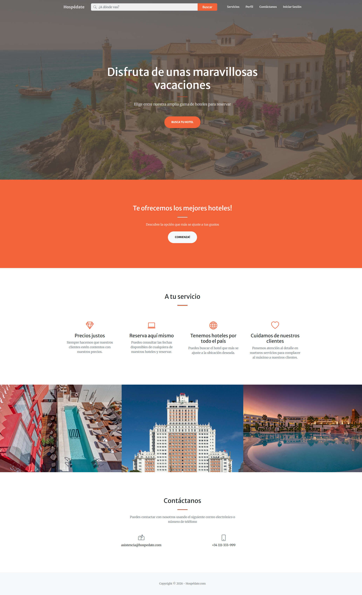

> [Página de inicio que muestra un banner promocional, información de servicios, contactos y tres de los hoteles más populares. Incluye barra de navegación, la barra de búsqueda, acceso a registro/login para usuarios no autenticados y acceso a secciones de información de servicios y contacto.]

#### **2. Página de lista de hoteles**


> [Página en la que se muestra una lista de hoteles desde la que se puede acceder a las páginas de los diferentes hoteles, incluye la barra de búsqueda y navegación con las opciones de acceso a perfil, al inicio de sesión y de vuelta al inicio.]

#### **3. Página de hotel**
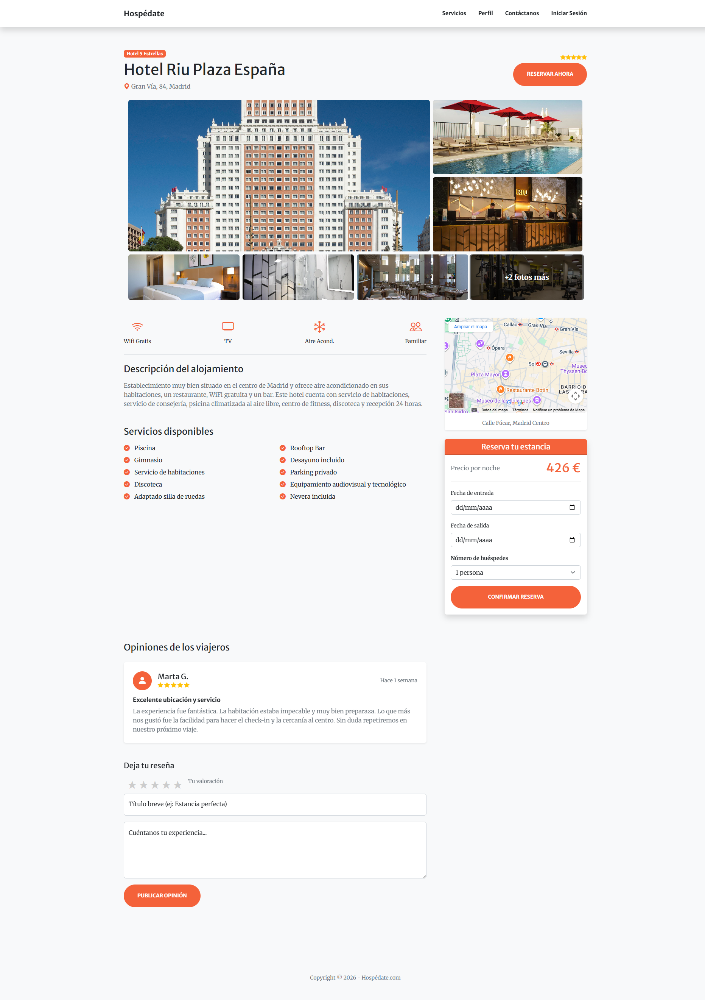

> [Página con la información del hotel, incluye una galería de imágenes del hotel, las reseñas de otros usuarios, el formulario para añadir una reseña y una tarjeta en la que elegir las fechas y número de huéspedes para reservar, junto con el botón de acceso a la confirmación de la reserva.]

#### **4. Página de resumen y confirmación de reserva**
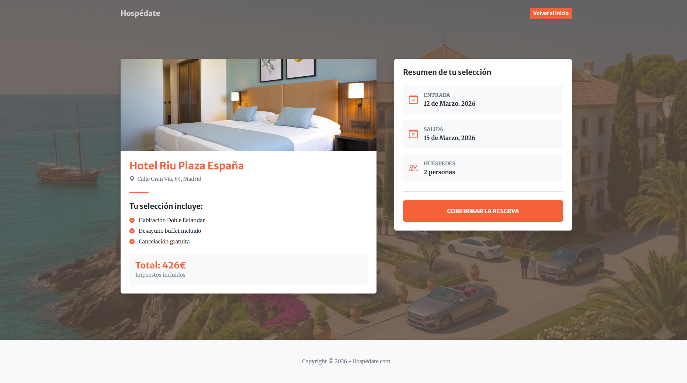

> [Página con dos tarjetas en la que se muestran los servicios y detalles de la reserva, además de un botón para finalizar la reserva.]

#### **5. Página de inicio de sesión**
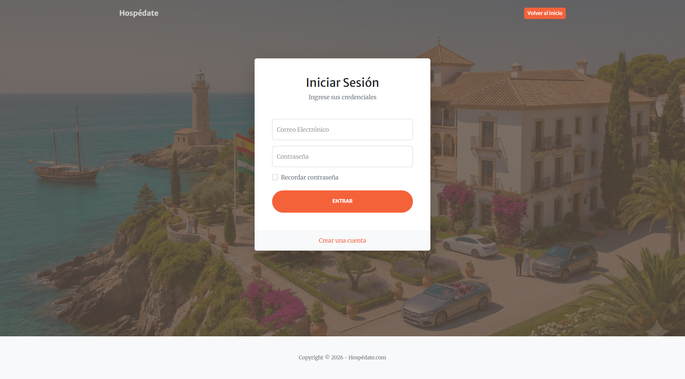

> [Página con un formulario para el inicio de sesión, además incluye la opción de acceder a la página de registro si no se posee un usuario registrado, y la opción de volver a la página principal.]

#### **6. Página de registro**
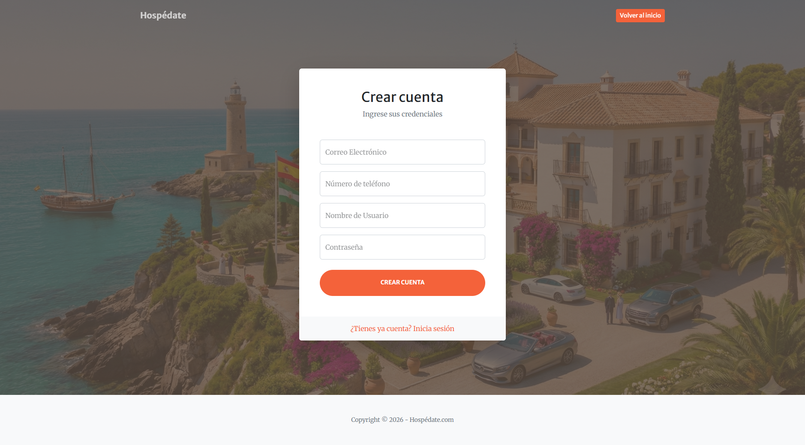

> [Página que muestra un formulario para el registro de un usuario. Incluye un acceso a la página de inicio de sesión si se posee usuario registrado y la opción de volver al inicio.]

#### **7. Página de perfil de usuario**
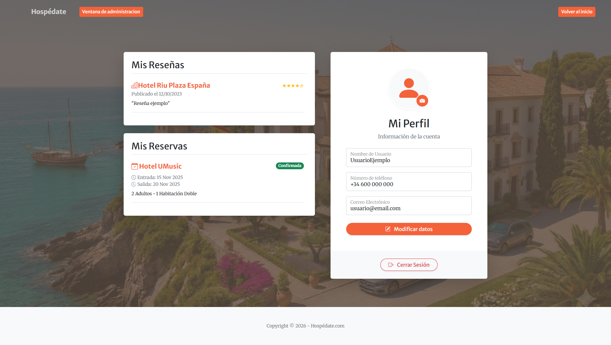

> [Página que muestra un panel con la información del usuario, junto a las opciones de modificar sus datos, subir una imagen de perfil y de cerrar sesión. Incluye también un panel mostrando las reservas y otro panel mostrando las reseñas del usuario, además de un botón para volver al incio o para acceder al panel de administrador. ]

#### **8. Página de administración de hoteles**
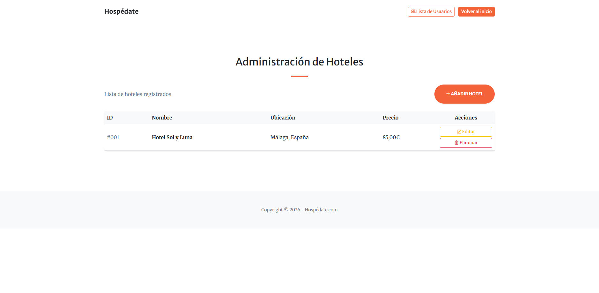

> [Página a la que únicamente tiene acceso el administrador en la que se muestra la lista de hoteles junto con las opciones de añadir, editar o eliminar dichas entidades. Incluye un botón para cambiar a la ventana de administración de usuarios y para la vuelta al inicio.]

#### **9. Página de edición de hoteles**


> [Página que cuenta con un formulario para que el administrador pueda editar la información del hotel seleccionado.]

#### **10. Página de creación de hoteles**
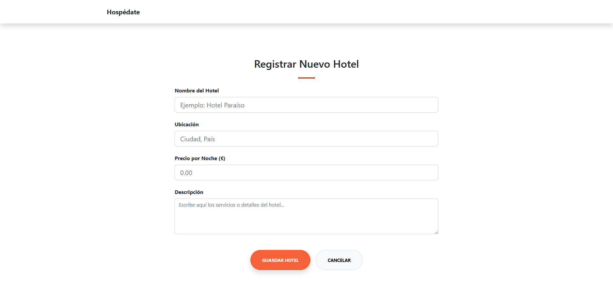

> [Página con un formulario para que el administrador pueda crear un hotel añadiendo la información.]

#### **11. Página de administración de usuarios**
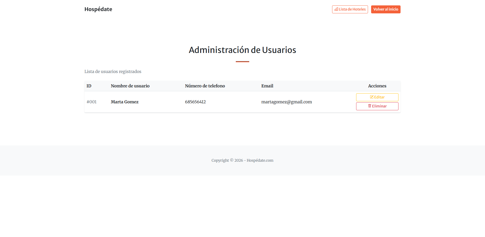

> [Página a la que únicamente tiene acceso el administrador y desde la que puede visualizar una lista de los usuarios junto con la opción de editar su información y eliminarlos.]

#### **12. Página de edición de usuarios**
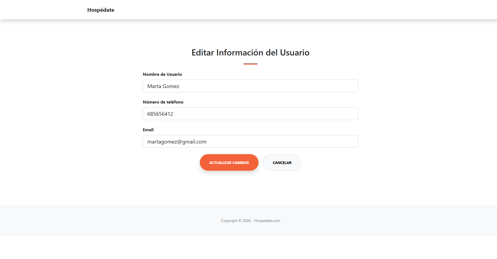

> [Página en la que el administrador puede editar la información de los usuarios.]


### **Participación de Miembros en la Práctica 1**

#### **Alumno 1 - Oliver Infante Jarana**

Creador de la página principal (index) y la página de resumen de reservas, también ha aportado pequeños cambios en otros archivos para implementar ciertas mejoras o correciones.

| Nº    | Commits      | Files      |
|:------------: |:------------:| :------------:|
|1| [Subida de plantilla gratuita](https://github.com/DWS-2026/dws-2026-project-base/commit/ece22bd905f99684f9cd33c7c6fbf00eb75498cf)  | [index.html](https://github.com/DWS-2026/dws-2026-project-base/blame/ece22bd905f99684f9cd33c7c6fbf00eb75498cf/index.html) <br>[style.css](https://github.com/DWS-2026/dws-2026-project-base/blob/ece22bd905f99684f9cd33c7c6fbf00eb75498cf/css/styles.css)   |
|2| [Cambios de frases e imágenes de prueba en el index](https://github.com/DWS-2026/dws-2026-project-base/commit/3539a6ced75649a3b3909178f48784268cdffde9)  | [index.html](https://github.com/DWS-2026/dws-2026-project-base/blob/3539a6ced75649a3b3909178f48784268cdffde9/index.html)   |
|3| [Cambios en la barra de navegación, implementación de la barra de búsqueda, implementación de script de la transparencia de la barra de búsqueda al hacer hover y subida de icono de prueba (no definitivo)](https://github.com/DWS-2026/dws-2026-project-base/commit/423085cb144c086f95e67f072ea9c438ab36b430#diff-0eb547304658805aad788d320f10bf1f292797b5e6d745a3bf617584da017051)  | [index.html](https://github.com/DWS-2026/dws-2026-project-base/blob/423085cb144c086f95e67f072ea9c438ab36b430/index.html) <br> [favicon.ico](https://github.com/DWS-2026/dws-2026-project-base/blob/423085cb144c086f95e67f072ea9c438ab36b430/assets/favicon.ico)  |
|4| [Implementación de barra de búsqueda en la página de lista de hoteles y simplificación del código con css](https://github.com/DWS-2026/dws-2026-project-base/commit/51631b82ce96f013d9d58a67ed91b704535e6509#diff-0eb547304658805aad788d320f10bf1f292797b5e6d745a3bf617584da017051)  | [HotelList.html](https://github.com/DWS-2026/dws-2026-project-base/blob/51631b82ce96f013d9d58a67ed91b704535e6509/HotelList.html) <br> [index.html](https://github.com/DWS-2026/dws-2026-project-base/blob/51631b82ce96f013d9d58a67ed91b704535e6509/index.html) <br> [style.css](https://github.com/DWS-2026/dws-2026-project-base/blob/51631b82ce96f013d9d58a67ed91b704535e6509/css/styles.css) |
|5| [Creación de la página de reserva](https://github.com/DWS-2026/dws-2026-project-base/commit/39605ad5f9171d4f341e204b5a3a0824f0c9685e)  | [reserve.html](https://github.com/DWS-2026/dws-2026-project-base/blob/39605ad5f9171d4f341e204b5a3a0824f0c9685e/reserve.html)   |

---

#### **Alumno 2 - Fernando Montero Molina**

Creador de las paginas de perfil de usuario, login y registro de cuentas. Aportacion de pequeñas modificaciones en los estilos para mejorar el apartado visual 

| Nº    | Commits      | Files      |
|:------------: |:------------:| :------------:|
|1| [Creación del panel de login y de registro](https://github.com/DWS-2026/dws-2026-project-base/commit/b123f5e34e374e1a3b6305da71f33486f6fd9a63)  | [login.html](https://github.com/DWS-2026/dws-2026-project-base/blob/b123f5e34e374e1a3b6305da71f33486f6fd9a63/login.html)<br>[register.html](https://github.com/DWS-2026/dws-2026-project-base/blob/b123f5e34e374e1a3b6305da71f33486f6fd9a63/register.html)
|2| [Creacion pantalla de perfil de usuario](https://github.com/DWS-2026/dws-2026-project-base/commit/7a2f6c6723922b06dad10cff31d319890623419e)  | [profile.html](https://github.com/DWS-2026/dws-2026-project-base/blob/7a2f6c6723922b06dad10cff31d319890623419e/profile.html)   |
|3| [Modificación del styles.css para incluir los estilos aplicados en login, registro y perfil](https://github.com/DWS-2026/project-grupo-12/commit/56fe3cc783f0be174536bae196ed2a3b6618880b)  | [login.html](https://github.com/DWS-2026/project-grupo-12/blob/56fe3cc783f0be174536bae196ed2a3b6618880b/login.html) <br>[register.html](https://github.com/DWS-2026/project-grupo-12/blob/56fe3cc783f0be174536bae196ed2a3b6618880b/register.html) <br> [profile.html](https://github.com/DWS-2026/project-grupo-12/blob/56fe3cc783f0be174536bae196ed2a3b6618880b/profile.html) <br> [style.css](https://github.com/DWS-2026/project-grupo-12/blob/56fe3cc783f0be174536bae196ed2a3b6618880b/css/styles.css)  |
|4| [Pantalla de perfil contiene panel de reseñas por usuario, ademas de mejorar UI](https://github.com/DWS-2026/dws-2026-project-base/commit/3c33ff017aa6cb6142d4e48c6cf0539c6c8c900a)   | [profile.html](https://github.com/DWS-2026/dws-2026-project-base/commit/3c33ff017aa6cb6142d4e48c6cf0539c6c8c900a#diff-f32cee85e87bd5c9da57ae49c3534d8ce4795276f4f02d27b4b3486d9ec2bcea) <br>[register.html](https://github.com/DWS-2026/dws-2026-project-base/blob/3c33ff017aa6cb6142d4e48c6cf0539c6c8c900a/register.html)<br>[login.html](https://github.com/DWS-2026/dws-2026-project-base/blob/3c33ff017aa6cb6142d4e48c6cf0539c6c8c900a/login.html) |
|5| [Pantalla de perfil ahora contiene un panel de reservas por usuario y mejora de comentarios](https://github.com/DWS-2026/dws-2026-project-base/commit/cc73bbd850d5f9ac940dc8ffceae0e1733afc72d)  | [profile.html](https://github.com/DWS-2026/dws-2026-project-base/blob/cc73bbd850d5f9ac940dc8ffceae0e1733afc72d/profile.html) <br> [login.html](https://github.com/DWS-2026/dws-2026-project-base/blob/cc73bbd850d5f9ac940dc8ffceae0e1733afc72d/login.html) <br> [register.html](https://github.com/DWS-2026/dws-2026-project-base/blob/cc73bbd850d5f9ac940dc8ffceae0e1733afc72d/register.html) <br> [style.css](https://github.com/DWS-2026/dws-2026-project-base/blob/cc73bbd850d5f9ac940dc8ffceae0e1733afc72d/css/styles.css) |

---

#### **Alumno 3 - Hugo Vara Carbajo**

Creador de la pagina la cual muestra la informacion de los dos hoteles disponibles actualmente, además de la creación de la página en la que se listán todos los hoteles de nuestra web.

| Nº    | Commits      | Files      |
|:------------: |:------------:| :------------:|
|1| [Creación de la página de hotel](https://github.com/DWS-2026/dws-2026-project-base/commit/530eaf509bf27a90e73a662b64a222e612881625)  | [hotel.html](https://github.com/DWS-2026/project-grupo-12/blob/main/hotel.html)   |
|2| [Configuración para ver la galeria de fotos de cada hotel](https://github.com/DWS-2026/dws-2026-project-base/commit/2fb0e30a233700297fa5f03857391a2e9aa16798)  | [hotel.html](https://github.com/DWS-2026/project-grupo-12/blob/main/hotel.html) <br>[sytle.css](https://github.com/DWS-2026/project-grupo-12/blob/main/README.md)  |
|3| [Creación de página de listado de hoteles](https://github.com/DWS-2026/dws-2026-project-base/commit/cfc1c5881250a0d412a700ce9abf6e3d3c7f23e6)  | [HotelList.html](https://github.com/DWS-2026/project-grupo-12/blob/main/HotelList.html)   |
|4| [Adición de reseñas en página de hoteles](https://github.com/DWS-2026/dws-2026-project-base/commit/f039266afd8fda1d853c46306b86a7587923be91)  | [hotel.html](https://github.com/DWS-2026/project-grupo-12/blob/main/hotel.html) <br>[style.css](https://github.com/DWS-2026/project-grupo-12/blob/main/README.md)   |
|5| [Definición información básica del proyecto](https://github.com/DWS-2026/dws-2026-project-base/commit/ef1f51621ee1d5b7cdce7425190bce2ab57d93bf)  | [README.md](https://github.com/DWS-2026/project-grupo-12/blob/main/README.md)   |

---

#### **Alumno 4 -  José Carlos Hernampérez Moreno**

Encargado de hacer la parte del administrador del hotel

| Nº    | Commits      | Files      |
|:------------: |:------------:| :------------:|
|1| [Creación de la estructura base y maquetación de la página de administración](https://github.com/DWS-2026/project-grupo-12/commit/df395427f08a4e81337c89c13a703acc6c64c0b4)  | [admin.html](https://github.com/DWS-2026/project-grupo-12/blob/df395427f08a4e81337c89c13a703acc6c64c0b4/admin.html)   |
|2| [Implementación de la gestión de hoteles: interfaces para creación y edición de elementos](https://github.com/DWS-2026/project-grupo-12/commit/7986a17785279d419ce83dd6e81c935c266028a9)  | [admin.html](https://github.com/DWS-2026/project-grupo-12/blob/7986a17785279d419ce83dd6e81c935c266028a9/admin.html)<br>[create_hotel.html](https://github.com/DWS-2026/project-grupo-12/blob/7986a17785279d419ce83dd6e81c935c266028a9/create_hotel.html)<br>[edit_hotel.html](https://github.com/DWS-2026/project-grupo-12/blob/7986a17785279d419ce83dd6e81c935c266028a9/edit_hotel.html)  |
|3| [Limpieza y documentación del código](https://github.com/DWS-2026/dws-2026-project-base/commit/6c8e06b355e9bbfbf0c7a4625175cba066a7763b)  | [admin.html](https://github.com/DWS-2026/dws-2026-project-base/blob/6c8e06b355e9bbfbf0c7a4625175cba066a7763b/admin.html)<br>[create_hotel.html](https://github.com/DWS-2026/dws-2026-project-base/blob/6c8e06b355e9bbfbf0c7a4625175cba066a7763b/create_hotel.html)<br>[edit_hotel.html](https://github.com/DWS-2026/dws-2026-project-base/blob/6c8e06b355e9bbfbf0c7a4625175cba066a7763b/edit_hotel.html)<br>[styles.css](https://github.com/DWS-2026/dws-2026-project-base/blob/6c8e06b355e9bbfbf0c7a4625175cba066a7763b/css/styles.css)   |
|4| [Renombrar admin.html a admin_hotel.html e integrar UI de administración de usuarios](https://github.com/DWS-2026/project-grupo-12/commit/1cb3cf090a95d3402c678da8b78d35f6bd6b8f04)  | [admin_hotel.html](https://github.com/DWS-2026/project-grupo-12/blob/1cb3cf090a95d3402c678da8b78d35f6bd6b8f04/admin_hotel.html)<br>[create_hotel.html](https://github.com/DWS-2026/project-grupo-12/blob/1cb3cf090a95d3402c678da8b78d35f6bd6b8f04/create_hotel.html)<br>[edit_hotel.html](https://github.com/DWS-2026/project-grupo-12/blob/1cb3cf090a95d3402c678da8b78d35f6bd6b8f04/edit_hotel.html)<br>[admin_users.html](https://github.com/DWS-2026/project-grupo-12/blob/1cb3cf090a95d3402c678da8b78d35f6bd6b8f04/admin_users.html)<br>[edit_users.html](https://github.com/DWS-2026/project-grupo-12/blob/1cb3cf090a95d3402c678da8b78d35f6bd6b8f04/edit_users.html) |
|5| [Eliminación del archivo admin.html que se había duplicado en commits anteriores](https://github.com/DWS-2026/dws-2026-project-base/commit/e69afcac106af16851210ab72619fc78f81eaac7)  | |
---

## 🛠 **Práctica 2: Web con HTML generado en servidor**

### **Vídeo de Demostración**
📹 **[Enlace al vídeo en YouTube](https://youtu.be/s8MD2pinY2w)**
> Vídeo mostrando las principales funcionalidades de la aplicación web.

### **Navegación y Capturas de Pantalla**

#### **Diagrama de Navegación**

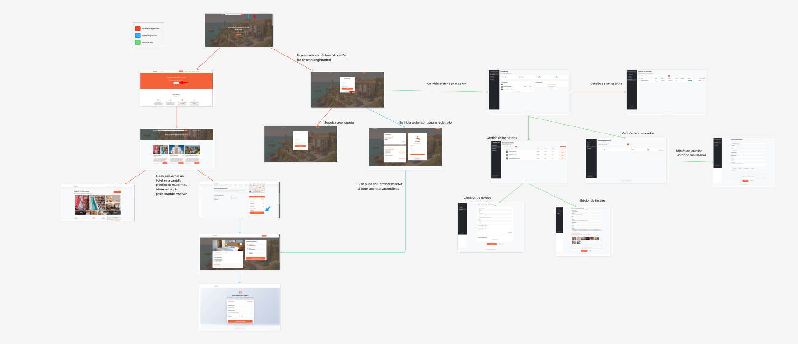

#### **Capturas de Pantalla Actualizadas**

#### **1. Página de pago**
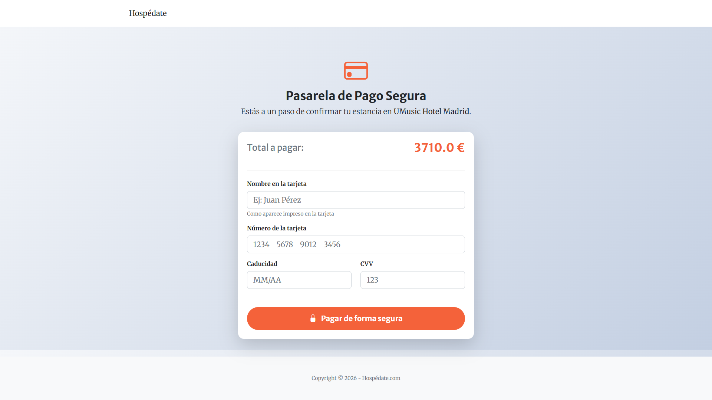

> [Página que muestra una pasarela de pago ficticia. Se realiza una validación en el lado del cliente en la que se revisa que los formatos sigan la tipificación de las tarjetas de crédito (Numero de la tarjeta de 16 dígitos, fecha de caducidad con el formato válido y mes existentes y un número de seguridad de 3 digitos).]

#### **2. Dashboard admin**
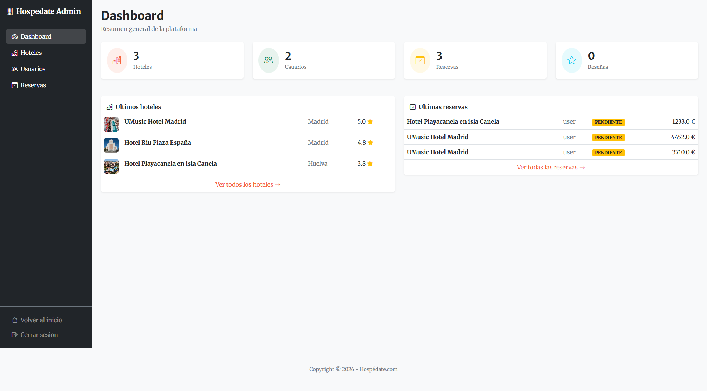

> [Página principal del administrador o administradores de la web, desde ella puede ver el número de hoteles creados, de usuarios registrados, de reservas realizadas y de reseñas puestas. Es la página a la que te redirecciona directamente al iniciar sesión como administrador y desde ella se puede acceder a las demás páginas de administración.]

#### **3. Página de gestión de hoteles**
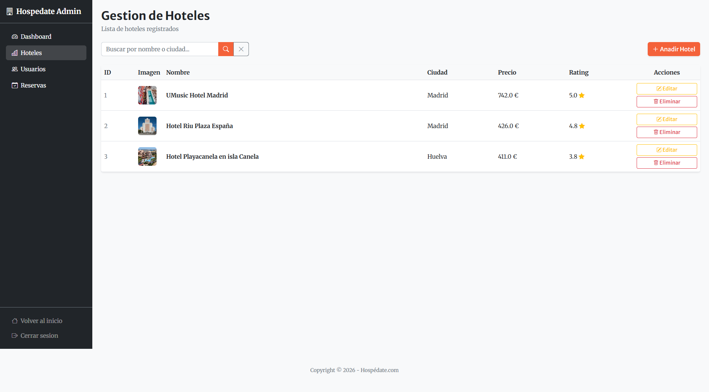

> [Página de gestión de hoteles a la que únicamente tiene acceso el administrador y desde la que puede visualizar todos los hoteles que hay registrados, buscarlos, añadir nuevos o modificar los ya creados.]

#### **4. Página de creación de hoteles**
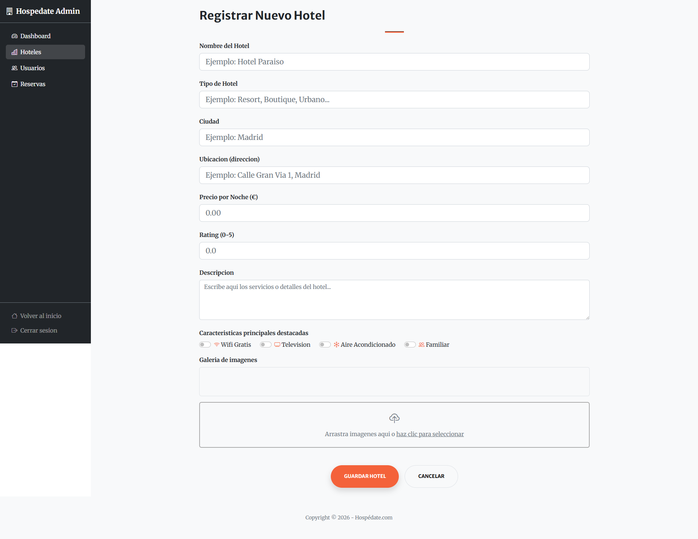

> [Página de creación de hoteles a la que solo tiene acceso el administrador y desde la que se puede crear un hotel especificando cada campo con su debida información.]

#### **5. Página de edición de hoteles**
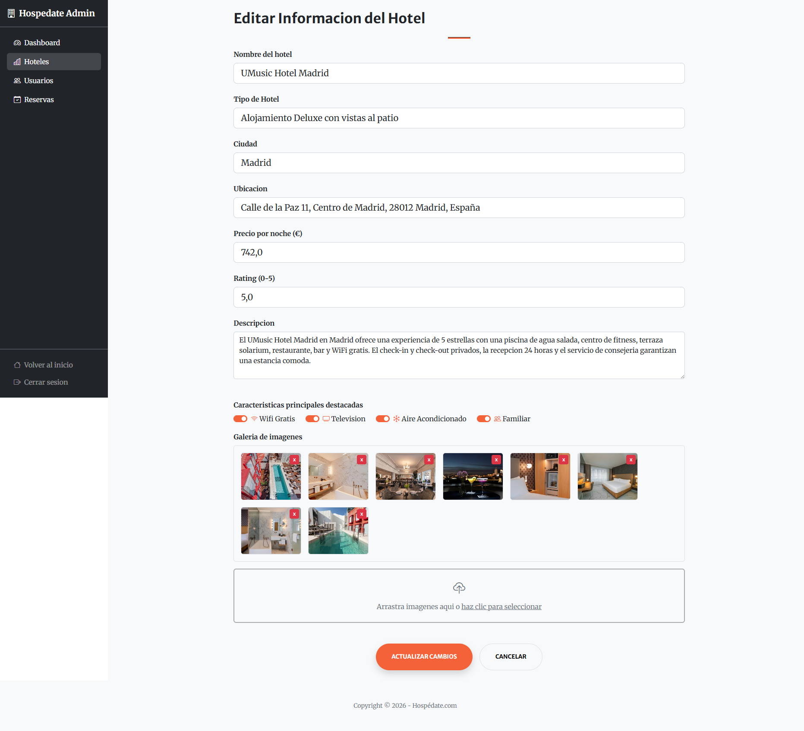

> [Página de edición de hoteles a la que solo tiene acceso el administrador y desde la que se puede editar toda la información de un hotel.]

#### **6. Página de gestión de usuarios**
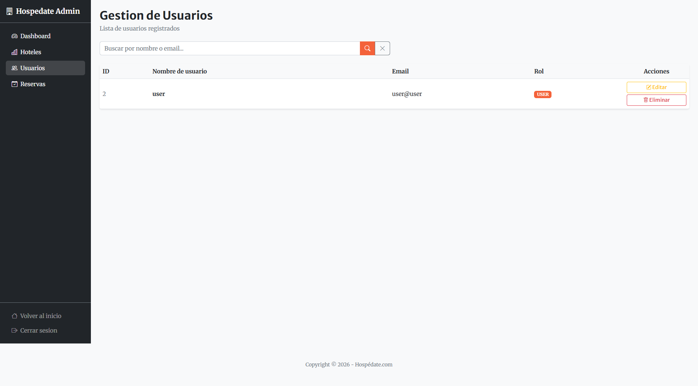

> [Página de gestión de usuarios a la que únicamente tiene acceso el administrador y desde la que se puede buscar los usuarios registrados, eliminarlos o editarlos.]

#### **7. Página de edición de usuarios**
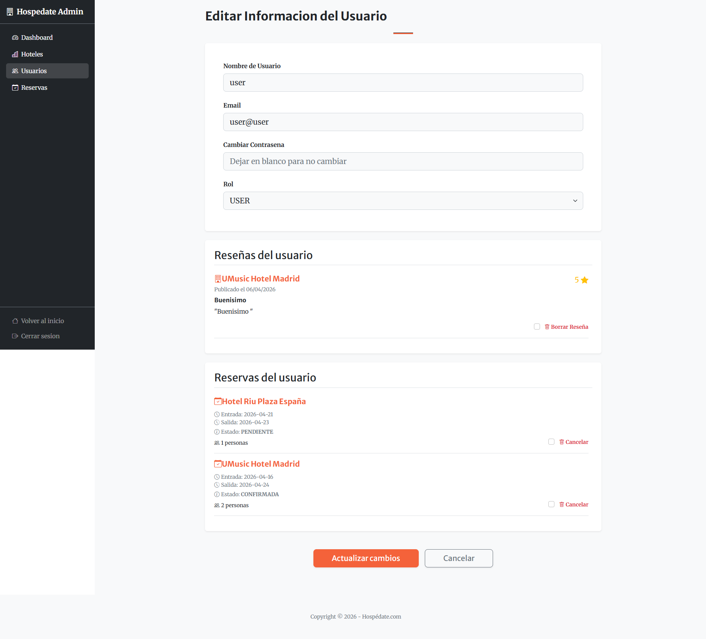

> [Página de edición de usuarios que solo es accesible por el administrador. Desde esta página se puede cambiar la información del usuario así como ver sus reseñas, reservas y eliminarlas.]

#### **8. Página de gestión de reservas**
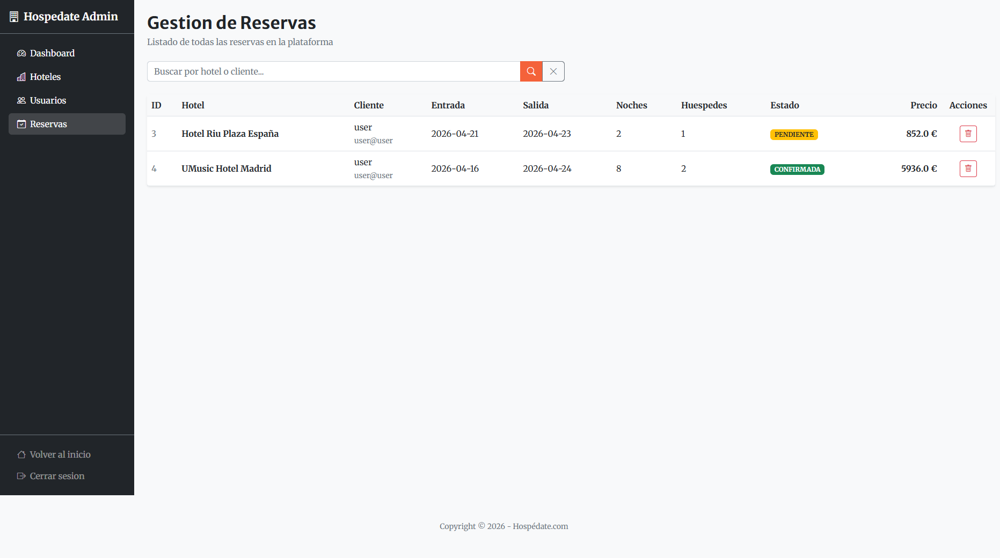

> [Página de gestión de reservas que solo tiene acceso el administrador y en la que se pueden visualizar las reservas con su respectiva información y estado, además de la opción de eliminarlas.]
### **Instrucciones de Ejecución**

#### **Requisitos Previos**
- **Java**: versión 21 o superior
- **Maven**: versión 3.8 o superior
- **MySQL**: versión 8.0 o superior
- **Git**: para clonar el repositorio

#### **Pasos para ejecutar la aplicación**

1. **Clonar el repositorio**
   
   ```bash
   git clone https://github.com/DWS-2026/project-grupo-12.git
   ```
2. Abrimos el proyecto con un editor de código, idealmente Visual Studio Code con las extensiones de Extension Pack for Java y Spring Boot Extension Pack instaladas. 

3. Iniciamos la aplicación y en el navegador buscamos https://localhost:8443

#### **Credenciales de prueba**
- **Usuario Admin**: usuario: `admin@admin`, contraseña: `admin`
- **Usuario Registrado**: usuario: `user@user`, contraseña: `user`

### **Diagrama de Entidades de Base de Datos**

Diagrama mostrando las entidades, sus campos y relaciones:

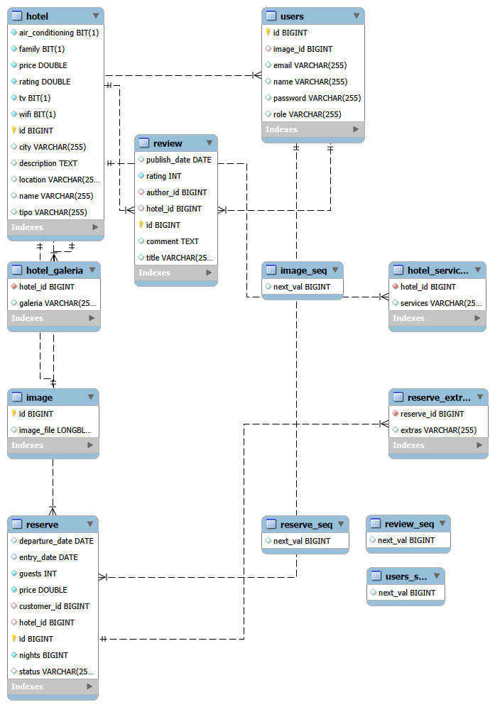

> El diagrama muestra las 4 entidades principales: Uusario, Hotel, Reserva y Reseña, con sus respectivos atributos y relaciones 1:N (un usuario puede tener múltiples reservas y reseñas), apoyadas por tablas auxiliares generadas por JPA para manejar colecciones de datos como galerías de imagenes y servicios.

### **Diagrama de Clases y Templates**

Diagrama de clases de la aplicación con diferenciación por colores o secciones:

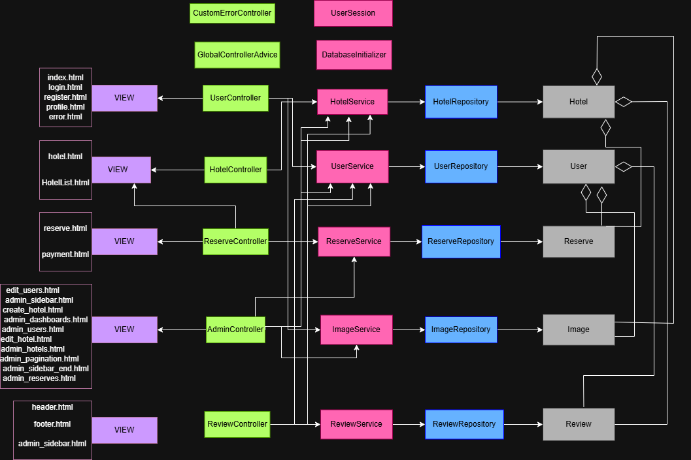

> El diagrama ilustra la arquitectura multicapa (MVC) de la aplicación en Spring Boot, dividida en vistas, Controladores, Servicios, Repositorios y Entidades. Las flechas muestran el flujo de dependencias desde la interfaz de usuario hasta el acceso de datos. Además, en la capa de dominio se representan las 4 entidades principales (Usuario, Hotel, Reserva y Reseña) y sus relaciones UML de composición y agregación, destacando cómo Usuario y Hotel actúan como entidades contenedoras que agrupan y gestionan sus múltiples Reservas y Reseñas. 

### **Participación de Miembros en la Práctica 2**

#### **Alumno 1 - Oliver Infante Jarana**

Encargado de la lógica de reservas y reviews, aportando también ayuda a otras partes del proyecto.

| Nº    | Commits      | Files      |
|:------------: |:------------:| :------------:|
|1| [Implementación de los controladores provisionales de reserva y review, actualización de los modelos de Review y Reserva con relaciones, implementación métodos getter y setter de Review y Reserva y adición de constructores vacíos para todas las entidades del modelo para JPA.](https://github.com/DWS-2026/dws-2026-project-base/commit/26956fe0d08a9a505e82fceb3c16026b5c4047e0)  | [ReserveController.java](https://github.com/DWS-2026/dws-2026-project-base/commit/26956fe0d08a9a505e82fceb3c16026b5c4047e0#diff-809f4aa1d02b04d10bfcc8c777d7ec4032f667ad67845e15aba67c3830ca5e3c) [ReviewController.java](https://github.com/DWS-2026/dws-2026-project-base/commit/26956fe0d08a9a505e82fceb3c16026b5c4047e0#diff-e36cc49fa88b7abf7055c806b01cd2ca8b1a8bf98265befafabe7596a3205e24)  [Hotel.java](https://github.com/DWS-2026/dws-2026-project-base/commit/26956fe0d08a9a505e82fceb3c16026b5c4047e0#diff-65c5ef94159ae651a1055f057a37ada51c8f0cf15c1b27f23b46ff6595b9ef36) [Image.java](https://github.com/DWS-2026/dws-2026-project-base/commit/26956fe0d08a9a505e82fceb3c16026b5c4047e0#diff-e5ebbd2ce1cbf0df5aebb74cee5341f6acfc3c8450aab2f6a475a003428fba41) [Reserve.java](https://github.com/DWS-2026/dws-2026-project-base/commit/26956fe0d08a9a505e82fceb3c16026b5c4047e0#diff-9514d52d62cc1873851d79098d29633aea066a479230dfac112223cfa06e908f) [Review.java](https://github.com/DWS-2026/dws-2026-project-base/commit/26956fe0d08a9a505e82fceb3c16026b5c4047e0#diff-070ad9f3164ff0f96d681be00249579076331fdb881e588f795293610f7bc5d5) [User.java](https://github.com/DWS-2026/dws-2026-project-base/commit/26956fe0d08a9a505e82fceb3c16026b5c4047e0#diff-0d9baf3b0112d359d9f1d02a250eeb9039a00aee866b2a10c230bca35cd15bda) |
|2| [Refactorización de la gestión de reservas y reseñas: actualización de ReserveController para procesar los datos de la reserva, mejora de ReviewController para incluir el título de la reseña y modificación de las plantillas para enlaces dinámicos de hoteles y detalles de la reserva.](https://github.com/DWS-2026/dws-2026-project-base/commit/1a661045318ed4fd02cdc0d0508b00f9e959df6c)  |  [HotelController.java](https://github.com/DWS-2026/dws-2026-project-base/commit/1a661045318ed4fd02cdc0d0508b00f9e959df6c#diff-bc97eb2cc6e658af289029d19ee14b788d26a099c9fb34aad9bf3c644bab2563)   [ReserveController.java](https://github.com/DWS-2026/dws-2026-project-base/commit/1a661045318ed4fd02cdc0d0508b00f9e959df6c#diff-809f4aa1d02b04d10bfcc8c777d7ec4032f667ad67845e15aba67c3830ca5e3c)  [ReviewController.java](https://github.com/DWS-2026/dws-2026-project-base/commit/1a661045318ed4fd02cdc0d0508b00f9e959df6c#diff-e36cc49fa88b7abf7055c806b01cd2ca8b1a8bf98265befafabe7596a3205e24)  [Hotel.java](https://github.com/DWS-2026/dws-2026-project-base/commit/1a661045318ed4fd02cdc0d0508b00f9e959df6c#diff-65c5ef94159ae651a1055f057a37ada51c8f0cf15c1b27f23b46ff6595b9ef36)  [HotelList.html](https://github.com/DWS-2026/dws-2026-project-base/commit/1a661045318ed4fd02cdc0d0508b00f9e959df6c#diff-16e2b1f08e0bd52c60fbc92287f3858405f9688fdf70ca3137c177bf14d9a369)  [hotel.html](https://github.com/DWS-2026/dws-2026-project-base/commit/1a661045318ed4fd02cdc0d0508b00f9e959df6c#diff-aa39f9ee6559f47e75b3129a51500206e75535bc045897e4c3e1392aeddcd3b8)  [index.html](https://github.com/DWS-2026/dws-2026-project-base/commit/1a661045318ed4fd02cdc0d0508b00f9e959df6c#diff-990ca690fd7e62e5dcd72791e98e61c4815eaa463df37fb68723545512f00c7c)  [reserve.html](https://github.com/DWS-2026/dws-2026-project-base/commit/1a661045318ed4fd02cdc0d0508b00f9e959df6c#diff-85884f272b14227f732992e83e7ab66d8b015b95560ce9a68149d0aa9cb5e989) |
|3| [Métodos en los controladores para mostrar reseñas y reservas en el perfil, métodos seguros con estado para recibir y guardar datos de reserva, lógica para guardar y mostrar reseñas, cambios en los botones según el estado de inicio de sesión y correcciones de errores menores.](https://github.com/DWS-2026/dws-2026-project-base/commit/1897d1086af0770548d127c0f4bb1655d9fba379)  |  [HotelController.java](https://github.com/DWS-2026/dws-2026-project-base/commit/1897d1086af0770548d127c0f4bb1655d9fba379#diff-bc97eb2cc6e658af289029d19ee14b788d26a099c9fb34aad9bf3c644bab2563)  [ReserveController.java](https://github.com/DWS-2026/dws-2026-project-base/commit/1897d1086af0770548d127c0f4bb1655d9fba379#diff-809f4aa1d02b04d10bfcc8c777d7ec4032f667ad67845e15aba67c3830ca5e3c)  [ReviewController.java](https://github.com/DWS-2026/dws-2026-project-base/commit/1897d1086af0770548d127c0f4bb1655d9fba379#diff-e36cc49fa88b7abf7055c806b01cd2ca8b1a8bf98265befafabe7596a3205e24)  [UserController.java](https://github.com/DWS-2026/dws-2026-project-base/commit/1897d1086af0770548d127c0f4bb1655d9fba379#diff-64d863bf33e917c08fbc3a9deba647a3bd3db4fde5159e366fda1e03f2ec8d6c)  [Reserve.java](https://github.com/DWS-2026/dws-2026-project-base/commit/1897d1086af0770548d127c0f4bb1655d9fba379#diff-9514d52d62cc1873851d79098d29633aea066a479230dfac112223cfa06e908f)  [Review.java](https://github.com/DWS-2026/dws-2026-project-base/commit/1897d1086af0770548d127c0f4bb1655d9fba379#diff-070ad9f3164ff0f96d681be00249579076331fdb881e588f795293610f7bc5d5)  [hotel.html](https://github.com/DWS-2026/dws-2026-project-base/commit/1897d1086af0770548d127c0f4bb1655d9fba379#diff-aa39f9ee6559f47e75b3129a51500206e75535bc045897e4c3e1392aeddcd3b8)  [index.html](https://github.com/DWS-2026/dws-2026-project-base/commit/1897d1086af0770548d127c0f4bb1655d9fba379#diff-990ca690fd7e62e5dcd72791e98e61c4815eaa463df37fb68723545512f00c7c)  [profile.html](https://github.com/DWS-2026/dws-2026-project-base/commit/1897d1086af0770548d127c0f4bb1655d9fba379#diff-6a3eff547cbea504f351e5b9e93e53baddd132b6b07d077ae4d446a355467017)  [reserve.html](https://github.com/DWS-2026/dws-2026-project-base/commit/1897d1086af0770548d127c0f4bb1655d9fba379#diff-85884f272b14227f732992e83e7ab66d8b015b95560ce9a68149d0aa9cb5e989)   |
|4| [Creación e implementación de ReserveService y ReviewService y lógica de cálculo de noches en la reserva](https://github.com/DWS-2026/dws-2026-project-base/commit/fa4a56d7f300e4a513d3598568bd409f6a54fbbd)  |  [ReserveController.java](https://github.com/DWS-2026/dws-2026-project-base/commit/fa4a56d7f300e4a513d3598568bd409f6a54fbbd#diff-809f4aa1d02b04d10bfcc8c777d7ec4032f667ad67845e15aba67c3830ca5e3c)  [ReviewController.java](https://github.com/DWS-2026/dws-2026-project-base/commit/fa4a56d7f300e4a513d3598568bd409f6a54fbbd#diff-e36cc49fa88b7abf7055c806b01cd2ca8b1a8bf98265befafabe7596a3205e24) [UserController.java](https://github.com/DWS-2026/dws-2026-project-base/commit/fa4a56d7f300e4a513d3598568bd409f6a54fbbd#diff-64d863bf33e917c08fbc3a9deba647a3bd3db4fde5159e366fda1e03f2ec8d6c) [Reserve.java](https://github.com/DWS-2026/dws-2026-project-base/commit/fa4a56d7f300e4a513d3598568bd409f6a54fbbd#diff-9514d52d62cc1873851d79098d29633aea066a479230dfac112223cfa06e908f) [ReserveService.java](https://github.com/DWS-2026/dws-2026-project-base/commit/fa4a56d7f300e4a513d3598568bd409f6a54fbbd#diff-46fe764a2126149893e4cb2a3b0000880deab9965f30577d5b5195a979ade1f6) [ReviewService.java](https://github.com/DWS-2026/dws-2026-project-base/commit/fa4a56d7f300e4a513d3598568bd409f6a54fbbd#diff-3bad6ec548943fd96e11748d470b15e8e48b13f5a124d125c051a089d537d309)  |
|5| [Método para eliminar reservas y reseñas, se simplificó y modificó el controlador para completar reservas pendientes, y se agregaron botones para cancelar y completar reservas. Se modificó el resumen dinámico de reservas.](https://github.com/DWS-2026/dws-2026-project-base/commit/f006c972ccb4850d128b1fb271a98fac16b7d5f5)  |  [ReserveController.java](https://github.com/DWS-2026/dws-2026-project-base/commit/f006c972ccb4850d128b1fb271a98fac16b7d5f5#diff-809f4aa1d02b04d10bfcc8c777d7ec4032f667ad67845e15aba67c3830ca5e3c)   [ReviewController.java](https://github.com/DWS-2026/dws-2026-project-base/commit/f006c972ccb4850d128b1fb271a98fac16b7d5f5#diff-e36cc49fa88b7abf7055c806b01cd2ca8b1a8bf98265befafabe7596a3205e24)  [UserController.java](https://github.com/DWS-2026/dws-2026-project-base/commit/f006c972ccb4850d128b1fb271a98fac16b7d5f5#diff-64d863bf33e917c08fbc3a9deba647a3bd3db4fde5159e366fda1e03f2ec8d6c)  [ReserveRepository.java](https://github.com/DWS-2026/dws-2026-project-base/commit/f006c972ccb4850d128b1fb271a98fac16b7d5f5#diff-9600b4d4febeb87b0ae43b0198cfb6f515f9ffc608a47b27da7ab85769c5f8a7)  [ReserveService.java](https://github.com/DWS-2026/dws-2026-project-base/commit/f006c972ccb4850d128b1fb271a98fac16b7d5f5#diff-46fe764a2126149893e4cb2a3b0000880deab9965f30577d5b5195a979ade1f6)  [ReviewService.java](https://github.com/DWS-2026/dws-2026-project-base/commit/f006c972ccb4850d128b1fb271a98fac16b7d5f5#diff-3bad6ec548943fd96e11748d470b15e8e48b13f5a124d125c051a089d537d309)  [profile.html](https://github.com/DWS-2026/dws-2026-project-base/commit/f006c972ccb4850d128b1fb271a98fac16b7d5f5#diff-6a3eff547cbea504f351e5b9e93e53baddd132b6b07d077ae4d446a355467017) [reserve.html](https://github.com/DWS-2026/dws-2026-project-base/commit/f006c972ccb4850d128b1fb271a98fac16b7d5f5#diff-85884f272b14227f732992e83e7ab66d8b015b95560ce9a68149d0aa9cb5e989)  |

---

#### **Alumno 2 - Fernando Montero Molina**

Desarrollador principal de la logica de la gestion de usuarios y seguridad de los mismos, incluyendo otras aportaciones. 

| Nº    | Commits      | Files      |
|:------------: |:------------:| :------------:|
|1| [Primera implementación del modelo Images utilizando Blob y de las consultas en el UserRepository, ReviewRepository e ImageRepository](https://github.com/DWS-2026/dws-2026-project-base/commit/d66df42deb6ab8bfa2b5c9e15dae22d575c72308)  | [Image.java](https://github.com/DWS-2026/dws-2026-project-base/commit/d66df42deb6ab8bfa2b5c9e15dae22d575c72308#diff-e5ebbd2ce1cbf0df5aebb74cee5341f6acfc3c8450aab2f6a475a003428fba41)  [HotelRepository.java](https://github.com/DWS-2026/dws-2026-project-base/commit/d66df42deb6ab8bfa2b5c9e15dae22d575c72308#diff-2141ae1a1d864c63b5d4ab6424a3484cd3e00cd2dce2fb52fd08d4205baaa1e7) [ImageRepository.java](https://github.com/DWS-2026/dws-2026-project-base/commit/d66df42deb6ab8bfa2b5c9e15dae22d575c72308#diff-d6474ac82eb2d7f7d4acd1da44006a2e061baa160a64d6004e2715532b53c72a) [ReviewRepository.java](https://github.com/DWS-2026/dws-2026-project-base/commit/d66df42deb6ab8bfa2b5c9e15dae22d575c72308#diff-00dc6dbc8ee6104e3d6da94f39e7dfc030705a5558f989e8cd5d73c9b5a9a461) [UserRepository.java](https://github.com/DWS-2026/dws-2026-project-base/commit/d66df42deb6ab8bfa2b5c9e15dae22d575c72308#diff-76b1248deeb4b1fddb1b896911ca9d12c24d3b1ccea8f506d3d8e11a39e9b791) [login.html](https://github.com/DWS-2026/dws-2026-project-base/commit/d66df42deb6ab8bfa2b5c9e15dae22d575c72308#diff-fc4351546432e19cdf99fca50eaf49aca86d229be1c28888dc280cf690561ddc) [profile.html](https://github.com/DWS-2026/dws-2026-project-base/commit/d66df42deb6ab8bfa2b5c9e15dae22d575c72308#diff-6a3eff547cbea504f351e5b9e93e53baddd132b6b07d077ae4d446a355467017) [register.html](https://github.com/DWS-2026/dws-2026-project-base/commit/d66df42deb6ab8bfa2b5c9e15dae22d575c72308#diff-4a0002199ce635072f69a144c900bd4ba74f86a325fdfe7e61d04108026142ed)  |
|2| [Creación de pagina de perfil con las Reseñas y Reservas de cada usuario mostrandose en un panel a la izquierda, además de modificaciones en el UserController para poder mostrar los elementos mencionados](https://github.com/DWS-2026/dws-2026-project-base/commit/66d4d86099dde0c4a40be1ddd86f357b99c5d68a)  | [UserController.java](https://github.com/DWS-2026/dws-2026-project-base/commit/66d4d86099dde0c4a40be1ddd86f357b99c5d68a#diff-64d863bf33e917c08fbc3a9deba647a3bd3db4fde5159e366fda1e03f2ec8d6c) [ReserveRepository.java](https://github.com/DWS-2026/dws-2026-project-base/commit/66d4d86099dde0c4a40be1ddd86f357b99c5d68a#diff-9600b4d4febeb87b0ae43b0198cfb6f515f9ffc608a47b27da7ab85769c5f8a7) [ReviewRepository.java](https://github.com/DWS-2026/dws-2026-project-base/commit/66d4d86099dde0c4a40be1ddd86f357b99c5d68a#diff-00dc6dbc8ee6104e3d6da94f39e7dfc030705a5558f989e8cd5d73c9b5a9a461) [profile.html](https://github.com/DWS-2026/dws-2026-project-base/commit/66d4d86099dde0c4a40be1ddd86f357b99c5d68a#diff-6a3eff547cbea504f351e5b9e93e53baddd132b6b07d077ae4d446a355467017) |
|3| [Modificación de lógica de sesión con la clase UserSession empleando SessionScope en la misma, añadiendo metodos para la obtencion de parámetros y verificación de la sesión de cada usuario](https://github.com/DWS-2026/dws-2026-project-base/commit/573fd8cf84e05fd166068add65e48b4cd3977711)  | [UserController.java](https://github.com/DWS-2026/dws-2026-project-base/commit/573fd8cf84e05fd166068add65e48b4cd3977711#diff-64d863bf33e917c08fbc3a9deba647a3bd3db4fde5159e366fda1e03f2ec8d6c) [User.java](https://github.com/DWS-2026/dws-2026-project-base/commit/573fd8cf84e05fd166068add65e48b4cd3977711#diff-0d9baf3b0112d359d9f1d02a250eeb9039a00aee866b2a10c230bca35cd15bda) [UserService.java](https://github.com/DWS-2026/dws-2026-project-base/commit/573fd8cf84e05fd166068add65e48b4cd3977711#diff-3ced97047ec38c77186258b00a0ab71a6701356fd47b158eb28cbaf75b6288df) [UserSession.java](https://github.com/DWS-2026/dws-2026-project-base/commit/573fd8cf84e05fd166068add65e48b4cd3977711#diff-1f2ade02a4ce7b4d04a00bc55f1bd0863711da68bffc5f1da70a918b0194a803) [profile.html](https://github.com/DWS-2026/dws-2026-project-base/commit/573fd8cf84e05fd166068add65e48b4cd3977711#diff-6a3eff547cbea504f351e5b9e93e53baddd132b6b07d077ae4d446a355467017) [register.html](https://github.com/DWS-2026/dws-2026-project-base/commit/573fd8cf84e05fd166068add65e48b4cd3977711#diff-4a0002199ce635072f69a144c900bd4ba74f86a325fdfe7e61d04108026142ed)   |
|4| [Crecion de la clase DatabaseInitializer, encargada de inicializar objetos en la aplicación, además de añadir redireccionamiento a la pagina de perfil o panel de administrador dependiendo del rol de cada usuario](https://github.com/DWS-2026/dws-2026-project-base/commit/7940d7d6c7c81347cb8ea521f064915dc77033a5)  | [SecurityConfiguration.java](https://github.com/DWS-2026/dws-2026-project-base/commit/7940d7d6c7c81347cb8ea521f064915dc77033a5#diff-238cf4c21301c5f4cfb6be85389f321acdee61386c1e29406ca01ad06909739c) [DatabaseInitializer.java](https://github.com/DWS-2026/dws-2026-project-base/commit/7940d7d6c7c81347cb8ea521f064915dc77033a5#diff-91f0302ae46706d12157576adaa17d20373a5b26cba9c07175559e593f509793) [HotelService.java](https://github.com/DWS-2026/dws-2026-project-base/commit/7940d7d6c7c81347cb8ea521f064915dc77033a5#diff-dbd05d68496250317089b513b97276b0ee8d91a687c0de559641c70e6e75416e) [application.properties](https://github.com/DWS-2026/dws-2026-project-base/commit/7940d7d6c7c81347cb8ea521f064915dc77033a5#diff-84093a6055412d8d6290c33dc21581a409dcc91bbaf8fb6923881cd8b41c9d96)  |
|5| [Implementacion de la edición de usuarios desde el panel de administrador y modificación de rutas accesibles por el administrador en SecurityConfiguration](https://github.com/DWS-2026/dws-2026-project-base/commit/c6f6ede9c366443f3b64ae6e37f209755c761e93)  | [AdminController.java.ava](https://github.com/DWS-2026/dws-2026-project-base/commit/c6f6ede9c366443f3b64ae6e37f209755c761e93#diff-8667ad8b4844812c6a3cacee727709fc6ba118e684f2c815600888beab8ca018) [SecurityConfigurtion.java](https://github.com/DWS-2026/dws-2026-project-base/commit/c6f6ede9c366443f3b64ae6e37f209755c761e93#diff-238cf4c21301c5f4cfb6be85389f321acdee61386c1e29406ca01ad06909739c) [edit_users.html](https://github.com/DWS-2026/dws-2026-project-base/commit/c6f6ede9c366443f3b64ae6e37f209755c761e93#diff-1531d0f3d5a46714d7bb8cc75b346344ba7c25b23619c3bfb58062819fa88c46)   |

---

#### **Alumno 3 - Hugo Vara Carbajo**

Desarrollador principal de todo lo relacionado con los hoteles ademas de añadir nuevas carcateristicas a la página.

| Nº    | Commits      | Files      |
|:------------: |:------------:| :------------:|
|1| [Primera implementación con la creación de controladores para gestionar la lógica de los hoteles y eliminación de parte del Javascript en el html](https://github.com/DWS-2026/dws-2026-project-base/commit/b3aa540bb00157241f58bcbc8072a99d124db67b)  | [HotellController.java](https://github.com/DWS-2026/dws-2026-project-base/commit/b3aa540bb00157241f58bcbc8072a99d124db67b#diff-bc97eb2cc6e658af289029d19ee14b788d26a099c9fb34aad9bf3c644bab2563)   | [Hotel.java](https://github.com/DWS-2026/dws-2026-project-base/commit/b3aa540bb00157241f58bcbc8072a99d124db67b#diff-65c5ef94159ae651a1055f057a37ada51c8f0cf15c1b27f23b46ff6595b9ef36)   | [HotelService.java](https://github.com/DWS-2026/dws-2026-project-base/commit/b3aa540bb00157241f58bcbc8072a99d124db67b#diff-dbd05d68496250317089b513b97276b0ee8d91a687c0de559641c70e6e75416e)   | [script.js](https://github.com/DWS-2026/dws-2026-project-base/commit/b3aa540bb00157241f58bcbc8072a99d124db67b#diff-0b6e7e4f31b7bc46db0d25666640b0cac284759400e484d4c53c76a6d1be80e8)   | [hotel.html](https://github.com/DWS-2026/dws-2026-project-base/commit/b3aa540bb00157241f58bcbc8072a99d124db67b#diff-aa39f9ee6559f47e75b3129a51500206e75535bc045897e4c3e1392aeddcd3b8)   |
|2| [Migración de la lógica de los hoteles al tipo de base de datos h2 hardcodeando dos hoteles para tener un ejemplo](https://github.com/DWS-2026/dws-2026-project-base/commit/92af07ea072f465aa083fbc033fcead2e7cc8337)  | [HotelController.java](https://github.com/DWS-2026/dws-2026-project-base/commit/92af07ea072f465aa083fbc033fcead2e7cc8337#diff-bc97eb2cc6e658af289029d19ee14b788d26a099c9fb34aad9bf3c644bab2563)   | [Hotel.java](https://github.com/DWS-2026/dws-2026-project-base/commit/92af07ea072f465aa083fbc033fcead2e7cc8337#diff-65c5ef94159ae651a1055f057a37ada51c8f0cf15c1b27f23b46ff6595b9ef36)   | [HotelRepository.java](https://github.com/DWS-2026/dws-2026-project-base/commit/92af07ea072f465aa083fbc033fcead2e7cc8337#diff-2141ae1a1d864c63b5d4ab6424a3484cd3e00cd2dce2fb52fd08d4205baaa1e7)   | [HotelService.java](https://github.com/DWS-2026/dws-2026-project-base/commit/92af07ea072f465aa083fbc033fcead2e7cc8337#diff-dbd05d68496250317089b513b97276b0ee8d91a687c0de559641c70e6e75416e)   |
|3| [Creación de la página de error con temática similar a la de la web y que muestra un mensaje distinto por tipo de error](https://github.com/DWS-2026/dws-2026-project-base/commit/1287b05d307163cc4367078e171a0c77048657c6)  | [GlobalControllerAdvice.java](https://github.com/DWS-2026/dws-2026-project-base/commit/1287b05d307163cc4367078e171a0c77048657c6#diff-338ab05f9f6dfe67c190a81eda12df8d0a33e76808afdedfa26ca36ccfc56aa6)   | [HotelController.java](https://github.com/DWS-2026/dws-2026-project-base/commit/1287b05d307163cc4367078e171a0c77048657c6#diff-bc97eb2cc6e658af289029d19ee14b788d26a099c9fb34aad9bf3c644bab2563)   | [error.html](https://github.com/DWS-2026/dws-2026-project-base/commit/1287b05d307163cc4367078e171a0c77048657c6#diff-b463f7bb0a20eb8074778bd185769f502fde8795f57125fef07d2339a217c893)   |
|4| [Migración de la página de listado de hoteles para utilizar mustache en ella de tal manera que no sea estática con todo hardcodeado](https://github.com/DWS-2026/dws-2026-project-base/commit/09292ede6e81c4f20a07ef65bccf1985d440022c)  | [HotelController.java](https://github.com/DWS-2026/dws-2026-project-base/commit/09292ede6e81c4f20a07ef65bccf1985d440022c#diff-bc97eb2cc6e658af289029d19ee14b788d26a099c9fb34aad9bf3c644bab2563)   | [style.css](https://github.com/DWS-2026/dws-2026-project-base/commit/09292ede6e81c4f20a07ef65bccf1985d440022c#diff-98673a45fee1da26a52925346f6c1f6d807ebc585a23526bbfcb75c9bce15bc5)   | [HotelList.html](https://github.com/DWS-2026/dws-2026-project-base/commit/09292ede6e81c4f20a07ef65bccf1985d440022c#diff-16e2b1f08e0bd52c60fbc92287f3858405f9688fdf70ca3137c177bf14d9a369)   | 
|5| [Adición de una pasarela de pago para que la web se asemeje más a la realidad](https://github.com/DWS-2026/dws-2026-project-base/commit/5be4f24cfd1e309c41b679e6ea8ed554c597a245)  | [ReserveController.java](https://github.com/DWS-2026/dws-2026-project-base/commit/5be4f24cfd1e309c41b679e6ea8ed554c597a245#diff-809f4aa1d02b04d10bfcc8c777d7ec4032f667ad67845e15aba67c3830ca5e3c)   | [payment.html](https://github.com/DWS-2026/dws-2026-project-base/commit/5be4f24cfd1e309c41b679e6ea8ed554c597a245#diff-fbd7a9291c3c85f6caed5e7e2d853ba18e454154c08256416a1016e4af36d3ba)   | [reserve.html](https://github.com/DWS-2026/dws-2026-project-base/commit/5be4f24cfd1e309c41b679e6ea8ed554c597a245#diff-85884f272b14227f732992e83e7ab66d8b015b95560ce9a68149d0aa9cb5e989)   |

---

  #### **Alumno 4 - José Carlos Hernampérez Moreno**

  Desarrollador principal del panel de administración completo, incluyendo dashboard, gestión de hoteles, usuarios y reservas, sistema de subida de imágenes con drag & drop, mejoras de seguridad (CSRF, sanitización) y
  paginación.

  | Nº    | Commits      | Files      |
  |:------------: |:------------:| :------------:|
  |1| [Separación de la lógica de negocio del controlador a las capas de servicio de HotelService y UserService siguiendo la arquitectura MVC](https://github.com/DWS-2026/project-grupo-12/commit/202d615)  |  [AdminController.java](https://github.com/DWS-2026/project-grupo-12/commit/202d615) <br>[HotelService.java](https://github.com/DWS-2026/project-grupo-12/commit/202d615)<br>[UserService.java](https://github.com/DWS-2026/project-grupo-12/commit/202d615)   |
  |2| [Implementación del sistema de subida de imágenes con drag & drop, eliminación y reordenamiento para la gestión de hoteles](https://github.com/DWS-2026/project-grupo-12/commit/9664be6)  | [AdminController.java](https://github.com/DWS-2026/project-grupo-12/commit/9664be6) <br>[HotelService.java](https://github.com/DWS-2026/project-grupo-12/commit/9664be6)<br>[create_hotel.html](https://github.com/DWS-2026/project-grupo-12/commit/9664be6) <br>[edit_hotel.html](https://github.com/DWS-2026/project-grupo-12/commit/9664be6)   |
  |3| [Creación del dashboard de administración, barra lateral de navegación, vista de reservas y mejoras de UX en todo el panel de admin](https://github.com/DWS-2026/project-grupo-12/commit/86b5b6e)  |  [AdminController.java](https://github.com/DWS-2026/project-grupo-12/commit/86b5b6e) <br>[admin_dashboard.html](https://github.com/DWS-2026/project-grupo-12/commit/86b5b6e)<br>[admin_sidebar.html](https://github.com/DWS-2026/project-grupo-12/commit/86b5b6e) <br>[admin_reserves.html](https://github.com/DWS-2026/project-grupo-12/commit/86b5b6e)   |
  |4| [Mejoras de seguridad: tokens CSRF en todos los formularios, validación de emails duplicados y sanitización de uploads](https://github.com/DWS-2026/project-grupo-12/commit/809ee8d)  |  [AdminController.java](https://github.com/DWS-2026/project-grupo-12/commit/809ee8d) <br>[CsrfControllerAdvice.java](https://github.com/DWS-2026/project-grupo-12/commit/809ee8d)<br>[UserService.java](https://github.com/DWS-2026/project-grupo-12/commit/809ee8d)   |
  |5| [Implementación de paginación en el panel de administración, cálculo automático de rating desde las reviews y seguridad transaccional](https://github.com/DWS-2026/project-grupo-12/commit/5d1cb40)  |  [AdminController.java](https://github.com/DWS-2026/project-grupo-12/commit/5d1cb40) <br>[Hotel.java](https://github.com/DWS-2026/project-grupo-12/commit/5d1cb40)<br>[admin_pagination.html](https://github.com/DWS-2026/project-grupo-12/commit/5d1cb40)   |

---

## 🛠 **Práctica 3: Incorporación de una API REST a la aplicación web, análisis de vulnerabilidades y contramedidas**

### **Vídeo de Demostración**
📹 **[Enlace al vídeo en YouTube](https://www.youtube.com/watch?v=x91MPoITQ3I)**
> Vídeo mostrando las principales funcionalidades de la aplicación web.

### **Documentación de la API REST**

#### **Especificación OpenAPI**
📄 **[Especificación OpenAPI (YAML)](/api-docs/api-docs.yaml)**

#### **Documentación HTML**
📖 **[Documentación API REST (HTML)](https://raw.githack.com/[usuario]/[repositorio]/main/api-docs/api-docs.html)**

> La documentación de la API REST se encuentra en la carpeta `/api-docs` del repositorio. Se ha generado automáticamente con SpringDoc a partir de las anotaciones en el código Java.

### **Diagrama de Clases y Templates Actualizado**

Diagrama actualizado incluyendo los @RestController y su relación con los @Service compartidos:


#### **Credenciales de Usuarios de Ejemplo**

| Rol | Usuario | Contraseña |
|:---|:---|:---|
| Administrador | admin | admin123 |
| Usuario Registrado | user1 | user123 |
| Usuario Registrado | user2 | user123 |

### **Participación de Miembros en la Práctica 3**

#### **Alumno 1 - [Nombre Completo]**

[Descripción de las tareas y responsabilidades principales del alumno en el proyecto]

| Nº    | Commits      | Files      |
|:------------: |:------------:| :------------:|
|1| [Descripción commit 1](URL_commit_1)  | [Archivo1](URL_archivo_1)   |
|2| [Descripción commit 2](URL_commit_2)  | [Archivo2](URL_archivo_2)   |
|3| [Descripción commit 3](URL_commit_3)  | [Archivo3](URL_archivo_3)   |
|4| [Descripción commit 4](URL_commit_4)  | [Archivo4](URL_archivo_4)   |
|5| [Descripción commit 5](URL_commit_5)  | [Archivo5](URL_archivo_5)   |

---

#### **Alumno 2 - [Nombre Completo]**

[Descripción de las tareas y responsabilidades principales del alumno en el proyecto]

| Nº    | Commits      | Files      |
|:------------: |:------------:| :------------:|
|1| [Descripción commit 1](URL_commit_1)  | [Archivo1](URL_archivo_1)   |
|2| [Descripción commit 2](URL_commit_2)  | [Archivo2](URL_archivo_2)   |
|3| [Descripción commit 3](URL_commit_3)  | [Archivo3](URL_archivo_3)   |
|4| [Descripción commit 4](URL_commit_4)  | [Archivo4](URL_archivo_4)   |
|5| [Descripción commit 5](URL_commit_5)  | [Archivo5](URL_archivo_5)   |

---

#### **Alumno 3 - [Nombre Completo]**

[Descripción de las tareas y responsabilidades principales del alumno en el proyecto]

| Nº    | Commits      | Files      |
|:------------: |:------------:| :------------:|
|1| [Descripción commit 1](URL_commit_1)  | [Archivo1](URL_archivo_1)   |
|2| [Descripción commit 2](URL_commit_2)  | [Archivo2](URL_archivo_2)   |
|3| [Descripción commit 3](URL_commit_3)  | [Archivo3](URL_archivo_3)   |
|4| [Descripción commit 4](URL_commit_4)  | [Archivo4](URL_archivo_4)   |
|5| [Descripción commit 5](URL_commit_5)  | [Archivo5](URL_archivo_5)   |

---

#### **Alumno 4 - [Nombre Completo]**

[Descripción de las tareas y responsabilidades principales del alumno en el proyecto]

| Nº    | Commits      | Files      |
|:------------: |:------------:| :------------:|
|1| [Descripción commit 1](URL_commit_1)  | [Archivo1](URL_archivo_1)   |
|2| [Descripción commit 2](URL_commit_2)  | [Archivo2](URL_archivo_2)   |
|3| [Descripción commit 3](URL_commit_3)  | [Archivo3](URL_archivo_3)   |
|4| [Descripción commit 4](URL_commit_4)  | [Archivo4](URL_archivo_4)   |
|5| [Descripción commit 5](URL_commit_5)  | [Archivo5](URL_archivo_5)   |
